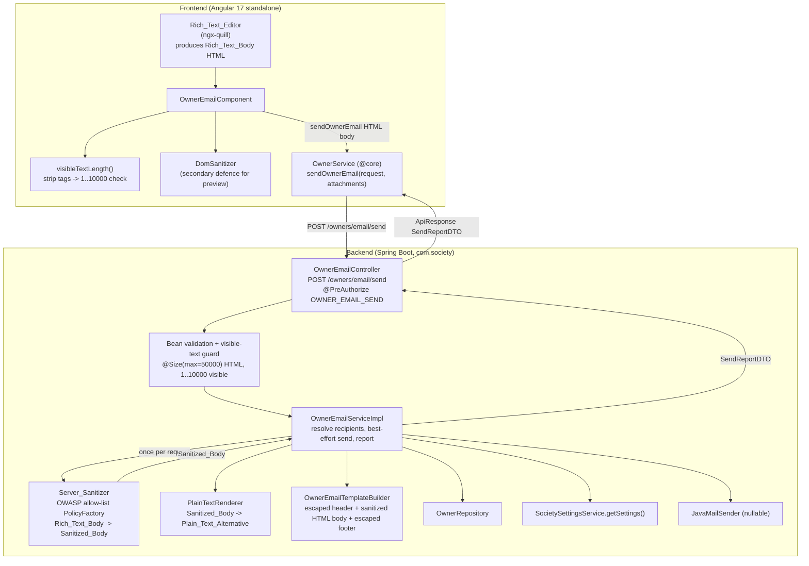
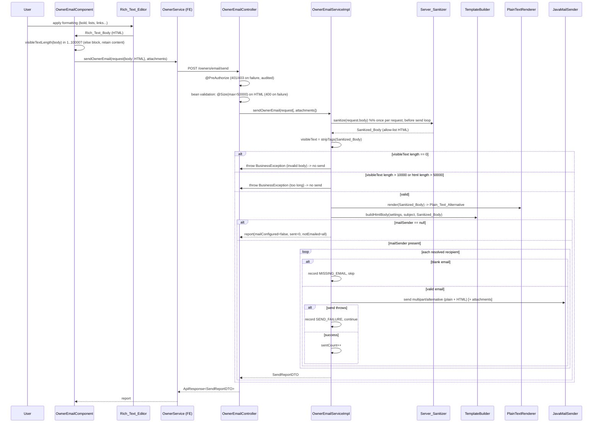

# Design Document

## Overview

The Owner Email Rich Text feature upgrades the message-body composition of the existing Owner Email feature from a plain `<textarea>` to a rich-text (WYSIWYG) editor. Users can apply word-level styling (bold, italic, underline, strikethrough), heading styles, ordered and unordered lists, paragraph and line breaks, and hyperlinks — and the formatting they apply is preserved end-to-end into the email owners receive.

The editor produces the body as **HTML** (`Rich_Text_Body`). That HTML is transmitted to the server, where it is the sole responsibility of an authoritative `Server_Sanitizer` to reduce it to a `Sanitized_Body` that contains only a safe allow-list of formatting. Only the `Sanitized_Body` is ever embedded into the email; a `Rich_Text_Body` is never embedded unsanitized. The sanitized HTML body replaces the plain-text body inside the existing three-part `Email_Template` (`Society_Header` → `Body` → `Footer`), and the assembled email is sent as a **multipart/alternative** message carrying both an HTML part and a derived plain-text part so recipients whose clients do not render HTML still receive a readable message.

This is a modification of an already-implemented feature, not a greenfield build. The design is grounded in the real classes that exist today and states precisely what changes:

- **`OwnerEmailTemplateBuilder`** (`com.society.module.owner.service`) currently emits **plain text** using `System.lineSeparator()`, but the message is sent with `helper.setText(body, true)` (HTML flag `true`) — so today the newlines do not render. This builder is changed to emit a proper **HTML document**: an escaped header block, the already-sanitized HTML body, and an escaped footer block. Its existing `BusinessException` validation for missing settings and empty user fields is preserved.
- **`OwnerEmailServiceImpl`** (`com.society.module.owner.service`) already performs best-effort per-recipient send with attachments, the `MAIL_NOT_CONFIGURED` / `MISSING_EMAIL` / `SEND_FAILURE` reasons, and a report whose counts reconcile. A new **sanitization step runs once per request** (before the send loop), and the send switches from single-part HTML to **multipart/alternative** (HTML + plain text) while keeping attachment support intact.
- **`SendOwnerEmailRequest`** (`com.society.module.owner.dto`) currently guards `body` with `@NotBlank @Size(max=10000)` on the **raw** string. Because markup inflates raw length, this is redefined per decision D2: a coarse `@Size(max=50000)` guard on the stored HTML for fast bean-validation rejection, plus a **visible-text** computation (1–10,000 characters) enforced server-side on the **sanitized** body.
- **`OwnerEmailController`** (`com.society.module.owner.controller`) already exposes `POST /owners/email/send` (JSON and multipart variants) under `@PreAuthorize("hasRole('SUPER_ADMIN') or hasAuthority('OWNER_EMAIL_SEND')")`, is constructed with `(OwnerEmailService, ObjectMapper, Validator)`, and returns the `ApiResponse` envelope. All of this is preserved.
- **`OwnerEmailComponent`** (`frontend/src/app/modules/owner/owner-email`) currently binds a plain `<textarea>` into a reactive form. Its body control is replaced by a `Rich_Text_Editor` that produces HTML, while the recipient selection, attachments, results panel, and timeout handling are unchanged. The `SendOwnerEmailRequest.body` frontend model stays a `string`, now carrying HTML.

The following decisions are settled (no longer open):

- **D1 — Hyperlinks and images.** Hyperlinks **are** allowed in the body, restricted to the URL schemes `http`, `https`, and `mailto`. Images are **out of scope** for the MVP.
- **D2 — Body size definition.** The body limit is **at most 10,000 visible (plain-text) characters** AND **at most 50,000 characters of stored sanitized HTML**, whichever is reached first.
- **D3 — Plain-text multipart alternative.** A `multipart/alternative` email carrying an HTML part **and** a derived plain-text part **is** produced.

This design covers requirements 1–7.

## Architecture

### Component Overview



### Send Sequence



### Key Architectural Decisions

- **Server-side sanitization is the authoritative XSS control (Req 3).** The `Server_Sanitizer` runs on the raw `Rich_Text_Body` inside the service, **before** any template assembly or send. The frontend `DomSanitizer` used for preview rendering is a secondary defence only; the server never trusts the client to have sanitized anything. The service embeds only the `Sanitized_Body`, never the raw `Rich_Text_Body` (Req 3.1, 3.6, 3.8).

- **Allow-list model, not deny-list.** Sanitization uses the **OWASP Java HTML Sanitizer**, whose `PolicyFactory` is allow-list based: only explicitly permitted elements/attributes survive; everything else (`script`, `iframe`, `object`, `embed`, `style`, `link`, `on*` handlers, unknown elements) is dropped without needing to enumerate it. This makes the closure property ("nothing outside the allow-list survives") structural rather than a game of blacklisting (Req 3.2, 3.3, 3.4). A dedicated element policy restricts `a[href]` to `http`/`https`/`mailto`, dropping the `href` (keeping the visible text) when the scheme is anything else (Req 3.5, D1).

- **Sanitize once per request, not per recipient.** The body is identical for every recipient, so sanitization, visible-text validation, plain-text derivation, and HTML-template assembly all happen a single time before the send loop. This keeps the per-recipient cost unchanged from today and keeps the best-effort loop untouched (Req 3.1, 5.4, 5.6).

- **Visible-text length is measured on the *sanitized* body (D2, Req 4.4/4.5).** Because sanitization can strip markup and thus reduce visible content, the authoritative 1–10,000 check is applied to the plain text extracted from the `Sanitized_Body` — i.e. exactly what will actually be sent. The raw-HTML `@Size(max=50000)` bean-validation guard is a coarse, fast pre-check against oversized payloads (Req 4.6); it is not the visible-text limit.

- **Template builder emits HTML (changed behavior).** `OwnerEmailTemplateBuilder` is changed from plain-text assembly to HTML-document assembly. Header/footer values come from settings and are **HTML-escaped** before insertion (they are plain data and must never be interpreted as markup); the body is inserted as **already-sanitized HTML** and is not re-escaped. This fixes the current latent bug where plain-text newlines never rendered under the `setText(..., true)` HTML flag (Req 2.2, 2.3).

- **Multipart/alternative reconciled with attachments (D3, Req 7).** `MimeMessageHelper(message, true)` is already multipart because attachments are supported. The `helper.setText(plainText, htmlText)` overload sets **both** alternative parts; JavaMail nests a `multipart/alternative` (plain + HTML) inside the outer `multipart/mixed` that also carries attachments. No conflict — the existing attachment code is unchanged.

- **ngx-quill for the editor (see Frontend rationale below).** Chosen over hand-rolled `contenteditable` and TipTap for the smallest integration cost against an allow-list this narrow, with adequate accessibility that the design hardens further.

## Components and Interfaces

### Backend

#### Server_Sanitizer (new)

New dependency in `backend/pom.xml`:

```xml
<!-- OWASP Java HTML Sanitizer: authoritative allow-list sanitization of the rich-text body -->
<dependency>
    <groupId>com.googlecode.owasp-java-html-sanitizer</groupId>
    <artifactId>owasp-java-html-sanitizer</artifactId>
    <version>20240325.1</version>
</dependency>
```

New component `com.society.module.owner.service.OwnerEmailSanitizer`:

```java
@Component
public class OwnerEmailSanitizer {

    // Allow-list matching Allowed_Formatting. Everything not named here is dropped.
    private static final PolicyFactory POLICY = new HtmlPolicyBuilder()
            // inline emphasis
            .allowElements("b", "strong", "i", "em", "u", "s", "strike")
            // headings + block structure + lists
            .allowElements("h1", "h2", "h3", "h4", "h5", "h6", "p", "br", "ul", "ol", "li")
            // hyperlinks restricted to safe schemes (Req 3.5, D1)
            .allowElements("a")
            .allowAttributes("href").onElements("a")
            .allowUrlProtocols("http", "https", "mailto")
            .requireRelNofollowOnLinks()
            .toFactory();

    /** Transforms a Rich_Text_Body into a Sanitized_Body containing only Allowed_Formatting.
     *  A null/blank input yields an empty string. Never throws on malformed markup. */
    public String sanitize(String richTextBody) {
        if (richTextBody == null) {
            return "";
        }
        return POLICY.sanitize(richTextBody);
    }

    /** Visible (plain-text) content of sanitized HTML, with tags removed and whitespace
     *  collapsed/trimmed. Used to enforce the 1..10000 visible-text bound (Req 4.4, 4.5). */
    public String visibleText(String sanitizedHtml) {
        if (sanitizedHtml == null) {
            return "";
        }
        String text = Jsoup.parse(sanitizedHtml).text(); // decodes entities, strips tags
        return text.trim();
    }
}
```

Notes on the allow-list model (Req 3.2–3.4):
- `script`, `iframe`, `object`, `embed`, `style`, and `link` elements are **not** in `allowElements`, so the `PolicyFactory` drops them (element removed; for elements like `script`/`style` their text content is discarded too).
- Any attribute whose name begins with `on` (e.g. `onclick`, `onerror`) is not allowed on any element and is dropped, along with all other unlisted attributes.
- For `<a>`, only `href` with an allowed protocol survives; a `javascript:`, `data:`, or otherwise disallowed scheme causes the `href` to be dropped while the anchor's visible text is retained (Req 3.5).
- `Jsoup` is pulled in transitively for `visibleText`; if not present as a managed dependency it is added explicitly (`org.jsoup:jsoup`).

#### OwnerEmailServiceImpl (modified)

Location: `com.society.module.owner.service.OwnerEmailServiceImpl` — the existing two-method contract is kept:

```java
public interface OwnerEmailService {
    SendReportDTO sendOwnerEmail(SendOwnerEmailRequest request);
    SendReportDTO sendOwnerEmail(SendOwnerEmailRequest request, List<MultipartFile> attachments);
}
```

Changes to the impl (collaborators gain the sanitizer and a plain-text renderer; the existing `mailSender`, `fromEmail`, `ownerRepository`, `societySettingsService`, `templateBuilder` are unchanged):

```java
private final OwnerEmailSanitizer sanitizer;
private final OwnerEmailPlainTextRenderer plainTextRenderer;
```

New pre-send block inside `sendOwnerEmail(request, attachments)`, placed **before** the mail-configured check and the recipient loop, replacing the current direct use of `request.getBody()`:

```java
// 1. Authoritative sanitization, once per request, before any assembly or send (Req 3.1).
String sanitizedBody = sanitizer.sanitize(request.getBody());

// 2. Visible-text validation on the sanitized body (Req 4.4, 4.5).
String visible = sanitizer.visibleText(sanitizedBody);
if (visible.isEmpty()) {
    throw new BusinessException("Message content is required");           // Req 4.4
}
if (visible.length() > 10_000) {
    throw new BusinessException("Message exceeds the 10,000 character limit"); // Req 4.5
}
if (sanitizedBody.length() > 50_000) {
    throw new BusinessException("Message body is too large");             // Req 4.6 (defence in depth)
}

// 3. Derive the plain-text alternative and assemble the HTML template from the SANITIZED body.
String plainText = plainTextRenderer.render(sanitizedBody, request.getSubject(), settings); // Req 7.2, 7.3
String assembledSubject = templateBuilder.buildSubject(request.getSubject());
String assembledHtml = templateBuilder.buildHtmlBody(settings, request.getSubject(), sanitizedBody); // Req 2.2, 2.3
```

The per-recipient send changes only the body call — from `helper.setText(assembledBody, true)` to the two-arg overload that sets both alternative parts:

```java
MimeMessage message = mailSender.createMimeMessage();
MimeMessageHelper helper = new MimeMessageHelper(message, true); // multipart: attachments still supported
helper.setFrom(fromEmail);
helper.setTo(email.trim());
helper.setSubject(assembledSubject);
helper.setText(plainText, assembledHtml);   // multipart/alternative: plain first, HTML second (Req 7.1)
attachAll(helper, validAttachments);         // unchanged
mailSender.send(message);
```

Everything else — `resolveRecipients`, `normaliseAttachments`, `attachAll`, `toEntry`, `buildReport`, the `mailSender == null` branch, the `MISSING_EMAIL`/`SEND_FAILURE` handling, and the count invariant — is unchanged (Req 5.2, 5.3, 5.4, 5.6). If sanitization or validation fails, a `BusinessException` propagates and **no send loop runs** (Req 3.7, 4.4–4.6).

#### OwnerEmailTemplateBuilder (modified)

Location: `com.society.module.owner.service.OwnerEmailTemplateBuilder`. Behavior changes from plain-text to HTML output; validation is preserved.

```java
/** Assembles an HTML email document in the fixed order header -> body -> footer.
 *  Header/footer settings values are HTML-escaped (plain data, never markup);
 *  the body is inserted as ALREADY-SANITIZED HTML and is not re-escaped.
 *  @throws BusinessException on missing settings or empty subject/body (unchanged). */
public String buildHtmlBody(SocietySettings settings, String subject, String sanitizedBody) {
    if (settings == null) {
        throw new BusinessException("Society settings are missing");
    }
    validateUserInput(subject, /* message presence already enforced upstream */ subject);
    validateHeaderSettings(settings);
    validateFooterSettings(settings);

    StringBuilder html = new StringBuilder();
    html.append("<div>");
    html.append(buildHtmlHeader(settings));   // uses esc(...) on every settings value
    html.append("<hr/>");
    html.append("<div><p><strong>Subject: ")
        .append(esc(subject.trim()))
        .append("</strong></p>");
    html.append(sanitizedBody);                // sanitized HTML, inserted verbatim
    html.append("</div>");
    html.append("<hr/>");
    html.append(buildHtmlFooter(settings));    // uses esc(...) on every settings value
    html.append("</div>");
    return html.toString();
}

/** HTML entity-escapes plain text so settings values can never inject markup. */
private String esc(String value) {
    return HtmlUtils.htmlEscape(value); // org.springframework.web.util.HtmlUtils
}
```

The existing `buildSubject(String)`, `validateUserInput`, `validateHeaderSettings`, `validateFooterSettings`, and `hasAnyAddressLine` methods are retained. The plain-text `buildHeader`/`buildFooter`/`buildBodySection` helpers are re-expressed as HTML (`buildHtmlHeader`/`buildHtmlFooter`) that wrap escaped values in `<p>`/`<br/>` markup. The subject-only `buildSubject` is unchanged (Req 4.5 of the base feature).

> Security note: the body is the **only** part inserted as raw HTML, and it is raw only because it has already passed through the `Server_Sanitizer`. Every settings-sourced value (society name, address, registration number, phone, email, chairman/secretary/treasurer names) is escaped, closing the injection path through society settings.

#### OwnerEmailPlainTextRenderer (new)

Location: `com.society.module.owner.service.OwnerEmailPlainTextRenderer`. Produces the `Plain_Text_Alternative` from the sanitized body (Req 7.2, 7.3).

```java
@Component
public class OwnerEmailPlainTextRenderer {

    /** Derives a readable plain-text rendering of the sanitized body, representing
     *  paragraph breaks as blank lines, ordered lists as "1. ", unordered lists as
     *  "- ", so structure survives for non-HTML clients (Req 7.2, 7.3). */
    public String render(String sanitizedHtml, String subject, SocietySettings settings) {
        // Uses Jsoup with a text-preserving output setting: <p>/<br> -> newlines,
        // <li> in <ol> -> "N. item", <li> in <ul> -> "- item".
        // Header/footer are rendered as plain lines mirroring the HTML template order.
        ...
    }
}
```

The renderer walks the sanitized DOM (Jsoup) so it operates on the same safe content the HTML part shows; it never sees the raw `Rich_Text_Body`.

#### OwnerEmailController (unchanged shape)

Location: `com.society.module.owner.controller.OwnerEmailController`. Constructor `(OwnerEmailService, ObjectMapper, Validator)`, both `POST /owners/email/send` variants (JSON + multipart), `@PreAuthorize("hasRole('SUPER_ADMIN') or hasAuthority('OWNER_EMAIL_SEND')")`, `ApiResponse` envelope, and `parseAndValidate` bean-validation for the multipart part are all retained (Req 5.5). The controller does **not** gain sanitization logic — sanitization lives in the service so both the JSON and multipart paths share it. The coarse `@Size(max=50000)` bean-validation on the raw HTML runs here (via `@Valid` and via `parseAndValidate`) for a fast 400 before the service is called (Req 4.6). If a `BusinessException` is thrown by sanitization/visible-text validation in the service, the existing `GlobalExceptionHandler` maps it to a client-facing error and no email is sent (Req 3.7, 4.4, 4.5).

### Frontend

#### Rich text editor selection

| Option | Integration cost | Accessibility | Bundle | Fit for this allow-list | Verdict |
|---|---|---|---|---|---|
| **ngx-quill / Quill** | Low — drop-in Angular wrapper, reactive-form friendly, toolbar config maps directly to bold/italic/underline/strike/headings/lists/link | Toolbar buttons are focusable; needs added ARIA names/labels and focus styling (design hardens this) | Moderate | Excellent — Quill's formats map 1:1 to the allow-list; `link` handler can constrain schemes client-side | **Chosen** |
| Hand-rolled `contenteditable` + Material toolbar | High — must implement selection/formatting, list toggling, link insertion, and HTML normalization by hand | Full control but must build all ARIA/keyboard behavior from scratch | Minimal | Good but costly to reach parity | Rejected (cost/risk) |
| TipTap (ProseMirror) | Moderate–high — powerful, schema-based; heavier to wire into Angular 17 standalone | Good, but more configuration | Larger | Overkill for this narrow allow-list | Rejected (overkill) |

**Decision:** use **ngx-quill** (Quill 2.x). New frontend dependency (added to `package.json`): `ngx-quill` and its peer `quill`. The Quill toolbar is configured to exactly the `Allowed_Formatting` set; the produced value is HTML bound into the reactive form. Server-side sanitization remains authoritative, so any formatting Quill emits beyond the allow-list is simply stripped on the server.

#### OwnerEmailComponent (modified)

Location: `frontend/src/app/modules/owner/owner-email/owner-email.component.ts`. The recipient selection, attachments block, results panel, spinner, and 30s timeout logic are unchanged. Two things change: the body control is a Quill editor, and body validation switches from raw-length to visible-text length.

Template change — replace the body `<textarea>` with the editor:

```html
<quill-editor formControlName="body"
              [modules]="quillModules"
              [styles]="{ minHeight: '200px' }"
              aria-label="Message body"
              (onContentChanged)="onBodyChanged($event)">
</quill-editor>
<div class="body-hint" aria-live="polite">
  {{ visibleLength }}/{{ bodyMax }} characters
</div>
<mat-error *ngIf="form.get('body')?.hasError('emptyVisible')">
  Please enter message content.
</mat-error>
<mat-error *ngIf="form.get('body')?.hasError('tooLongVisible')">
  Message cannot exceed {{ bodyMax }} visible characters.
</mat-error>
```

Toolbar configured to the allow-list (Req 1.2–1.7):

```typescript
quillModules = {
  toolbar: [
    ['bold', 'italic', 'underline', 'strike'],
    [{ header: [1, 2, 3, false] }],
    [{ list: 'ordered' }, { list: 'bullet' }],
    ['link']
  ]
};
```

Visible-text validation (Req 4.1–4.3) — the reactive-form validator strips tags from the editor HTML and counts visible characters:

```typescript
/** Visible-text length of editor HTML: strip tags, decode entities, trim. */
private visibleTextLength(html: string): number {
  const el = document.createElement('div');
  el.innerHTML = html ?? '';
  return (el.textContent ?? '').trim().length;
}

private bodyVisibleValidator = (control: AbstractControl): ValidationErrors | null => {
  const len = this.visibleTextLength(control.value ?? '');
  if (len === 0) { return { emptyVisible: true }; }      // Req 4.2
  if (len > BODY_MAX) { return { tooLongVisible: true }; } // Req 4.3
  return null;
};
```

On block (empty or over-length), submission is prevented and the composed content and recipient selection are retained, mirroring the existing behavior (Req 4.2). The link handler restricts insertion to `http`/`https`/`mailto` as a UX aid; the server enforcement remains authoritative.

**Secondary-defence preview (Req 3.8):** any preview rendering of the body uses Angular's `DomSanitizer` (`bypassSecurityTrustHtml` is **not** used; the value is passed through `sanitize(SecurityContext.HTML, ...)`), so the composition/preview views never execute untrusted markup even before the server sees it.

**Accessibility hardening (Req 6):** because Quill's default toolbar buttons lack robust ARIA, the component adds:
- Keyboard operability: toolbar buttons are in the tab order and Quill's keyboard shortcuts (Ctrl/Cmd+B/I/U) are enabled (Req 6.1).
- Accessible names: each toolbar button is given an `aria-label` (e.g. "Bold", "Numbered list", "Insert link") via a small post-init pass over the toolbar DOM, so screen readers announce purpose (Req 6.2).
- Toggle state: active/inactive formatting buttons expose `aria-pressed` reflecting Quill's format state on selection change (Req 6.3).
- Visible focus: a CSS `:focus-visible` outline is applied to toolbar controls (Req 6.4).

#### OwnerService (unchanged)

`@core/services/owner.service.ts` — `sendOwnerEmail(request, attachments)` is unchanged; the `body` field simply now carries HTML.

## Data Models

### Backend DTOs

`SendOwnerEmailRequest` (`com.society.module.owner.dto`) — the `body` validation changes; everything else is unchanged:

```java
@Data
public class SendOwnerEmailRequest {

    @NotNull(message = "Recipient scope is required")
    private RecipientScope recipientScope;

    private List<Long> ownerIds;

    @NotBlank(message = "Subject is required")
    @Size(max = 200, message = "Subject must not exceed 200 characters")
    private String subject;

    // CHANGED (D2): coarse guard on the RAW rich-text HTML for a fast bean-validation
    // rejection. The authoritative visible-text limit (1..10000) is enforced in the
    // service on the SANITIZED body. @NotBlank stays so a totally empty payload is
    // rejected at the edge; empty *visible* content is caught in the service (Req 4.4).
    @NotBlank(message = "Body is required")
    @Size(max = 50000, message = "Body must not exceed 50000 characters")
    private String body;
}
```

Rationale: the old `@Size(max=10000)` on the raw string is wrong for HTML because markup inflates the count — a legitimate formatted message under 10,000 visible characters can exceed 10,000 raw characters. The raw guard becomes a coarse 50,000-char ceiling (Req 4.6); the meaningful limit is the sanitized visible-text length (Req 4.4, 4.5).

`SendReportDTO`, `NotEmailedEntry`, `NotEmailedReason`, and `RecipientScope` are **unchanged** — the send-report contract and its `sentCount + notEmailedCount == totalAttempted` invariant are preserved (Req 5.4, 5.6).

### Frontend models

`@core/models/owner.model.ts` — **no type changes.** `SendOwnerEmailRequest.body` remains a `string`; it now carries HTML produced by the editor rather than plain text. `SendReport`, `NotEmailedEntry`, `NotEmailedReason`, and `RecipientScope` are unchanged.

### What changes vs. the existing owner-email feature

| Element | owner-email (today) | owner-email-rich-text (this design) |
|---|---|---|
| Body input control | plain `<textarea>` | ngx-quill `Rich_Text_Editor` producing HTML |
| Body content | plain text | sanitized HTML |
| `SendOwnerEmailRequest.body` validation | `@NotBlank @Size(max=10000)` on raw text | `@NotBlank @Size(max=50000)` on raw HTML + service-side 1..10000 visible-text |
| Template builder output | plain text (`System.lineSeparator()`) | HTML document (escaped header/footer + sanitized body) |
| Email content type | single-part HTML (`setText(body, true)`) | multipart/alternative (plain + HTML) |
| Sanitizer | none | `OwnerEmailSanitizer` (OWASP allow-list) — new |
| Plain-text renderer | none | `OwnerEmailPlainTextRenderer` — new |
| Editor dependency | none | `ngx-quill` + `quill` — new |
| Sanitizer dependency | none | OWASP Java HTML Sanitizer (+ Jsoup) — new |

### SocietySettings → HTML template mapping (unchanged fields, now escaped)

| Template section | SocietySettings fields (HTML-escaped) |
|---|---|
| Header | `societyName`, `addressLine1`, `addressLine2`, `city`, `state`, `pincode`, `registrationNumber`, `phone`, `email` |
| Body | user `subject` (escaped) + `Sanitized_Body` (inserted as safe HTML) |
| Footer | `chairmanName`, `secretaryName`, `treasurerName` |

## Correctness Properties

*A property is a characteristic or behavior that should hold true across all valid executions of a system — essentially, a formal statement about what the system should do. Properties serve as the bridge between human-readable specifications and machine-verifiable correctness guarantees.*

This feature is strongly suited to property-based testing: sanitization, visible-text extraction, formatting preservation, template ordering, and plain-text derivation are pure input→output transformations with clear "for all inputs" statements over a very large input space (arbitrary HTML). The mail transport, the multipart structure of the sent message, and the authorization guard do not vary meaningfully with input and are covered by integration/example tests (see Testing Strategy).

The prework consolidated overlapping criteria during property reflection:
- Allow-list closure appears in 3.2, 3.3, 3.4, and 3.6 (named dangerous elements, `on*` attributes, and post-embedding closure are all special cases) → consolidated into one closure property whose generators always inject `script`/`iframe`/`object`/`embed`/`style`/`link` elements and `on*` attributes.
- The server visible-text bound appears in 4.4 (lower) and 4.5 (upper) → consolidated into one visible-text-length invariant measured on the sanitized body.
- The client visible-text bound appears in 4.1, 4.2, and 4.3 → consolidated into one client-side validation property.
- Backward-compatible behaviors (5.2, 5.3, 5.4, 5.6) are retained as properties to assert the rich-text change does not break the existing send/report guarantees.

### Property 1: Sanitization allow-list closure

*For any* input HTML string (including arbitrary `script`, `iframe`, `object`, `embed`, `style`, `link` elements, `on*` event-handler attributes, and any other unlisted elements or attributes), the `Sanitized_Body` produced by the `Server_Sanitizer` SHALL contain only elements and attributes within the `Allowed_Formatting` allow-list and SHALL contain none of the disallowed elements, none of the `on*` attributes, and no inline script — and this closure SHALL still hold for the body region of the assembled HTML that is actually embedded.

**Feature: owner-email-rich-text, Property 1**
**Validates: Requirements 3.2, 3.3, 3.4, 3.6**

### Property 2: Hyperlink scheme allow-list

*For any* anchor element in the input, if its `href` uses an `Allowed_Url_Scheme` (`http`, `https`, `mailto`) then the `Sanitized_Body` SHALL retain that `href`; and if it uses any other scheme (e.g. `javascript`, `data`) then the `Sanitized_Body` SHALL remove the `href` while retaining the anchor's visible text.

**Feature: owner-email-rich-text, Property 2**
**Validates: Requirements 3.5**

### Property 3: Allowed formatting is preserved

*For any* input composed only of `Allowed_Formatting` markup (bold, italic, underline, strikethrough, headings, ordered lists, unordered lists, paragraphs, line breaks, and allowed-scheme hyperlinks), every such formatting element present in the input SHALL still be present in the `Sanitized_Body` and in the body region of the assembled HTML, so the received email renders the same formatting the user applied.

**Feature: owner-email-rich-text, Property 3**
**Validates: Requirements 2.3**

### Property 4: Template ordering is header-then-body-then-footer

*For any* valid `SocietySettings`, any non-empty subject, and any `Sanitized_Body`, the assembled HTML SHALL place the `Society_Header` before the `Body` and the `Body` before the `Footer`.

**Feature: owner-email-rich-text, Property 4**
**Validates: Requirements 2.2**

### Property 5: Server visible-text-length invariant

*For any* input `Rich_Text_Body`, the server SHALL compute the visible text of the `Sanitized_Body` (markup removed, whitespace trimmed) and: reject the request with an error and initiate no send when that length is `0`; reject the request with an error and initiate no send when that length exceeds `10,000`; and otherwise (length in `1..10,000`) proceed. Rejection SHALL leave no partial record.

**Feature: owner-email-rich-text, Property 5**
**Validates: Requirements 4.4, 4.5**

### Property 6: Plain-text alternative derives from visible text

*For any* `Sanitized_Body`, the `Plain_Text_Alternative` derived from it SHALL contain no HTML tag markup and SHALL contain the visible textual content of the sanitized body, so the alternative conveys the same message content without markup.

**Feature: owner-email-rich-text, Property 6**
**Validates: Requirements 7.2**

### Property 7: Client-side visible-text validation

*For any* editor HTML value, the component's body validator SHALL compute visible-text length (tags stripped, trimmed) and block submission with the appropriate message when the length is `0` or exceeds `10,000`, and accept it otherwise; on block the composed content and recipient selection SHALL be retained.

**Feature: owner-email-rich-text, Property 7**
**Validates: Requirements 4.1, 4.2, 4.3**

### Property 8: Recipient classification is preserved

*For any* resolved recipient set mixing owners with valid (non-blank) and invalid (null/blank) email addresses, the service SHALL invoke the mail sender only for valid recipients, SHALL never send to any invalid recipient, and SHALL record every invalid recipient in the not-emailed list with a `MISSING_EMAIL` reason.

**Feature: owner-email-rich-text, Property 8**
**Validates: Requirements 5.2**

### Property 9: Mail-absent yields a graceful zero-sent report

*For any* resolved recipient set, when the `JavaMailSender` is absent the service SHALL return a report with `sentCount == 0`, `mailConfigured == false`, and `notEmailedCount == totalAttempted`, returning control normally without propagating an error.

**Feature: owner-email-rich-text, Property 9**
**Validates: Requirements 5.3**

### Property 10: A per-recipient send failure does not halt the others

*For any* resolved recipient set where an arbitrary subset of sends throws, the service SHALL still attempt delivery to every remaining valid recipient, SHALL record each failed recipient with a `SEND_FAILURE` reason, and SHALL preserve the count invariant.

**Feature: owner-email-rich-text, Property 10**
**Validates: Requirements 5.4**

### Property 11: Send report counts reconcile

*For any* resolved recipient set and any mix of outcomes, the returned `SendReportDTO` SHALL satisfy `sentCount + notEmailedCount == totalAttempted`, where `totalAttempted` equals the number of resolved recipients, and `notEmailed.size() == notEmailedCount`.

**Feature: owner-email-rich-text, Property 11**
**Validates: Requirements 5.6**

## Error Handling

### Backend

- **Coarse bean validation (Req 4.6):** `@NotBlank @Size(max=50000)` on `SendOwnerEmailRequest.body` (and `@Size(max=200)` on `subject`, `@NotNull` on `recipientScope`). Violations become a 400 via the existing `GlobalExceptionHandler` before the service runs — for both the `@Valid @RequestBody` JSON path and the `parseAndValidate` multipart path. No partial record is created.
- **Sanitization failure (Req 3.7):** the OWASP sanitizer does not throw on malformed markup, but the service treats any failure of the sanitization/derivation step as a hard stop — a `BusinessException` ("message content could not be processed") propagates, mapped by `GlobalExceptionHandler`, and the recipient loop never runs.
- **Empty visible text (Req 4.4):** when the sanitized body's visible text is empty, the service throws `BusinessException` ("Message content is required") before any send; no partial record.
- **Over-length visible text (Req 4.5):** when the sanitized visible text exceeds 10,000 characters, the service throws `BusinessException` indicating the limit; no send, no partial record.
- **Over-size HTML (Req 4.6):** the raw HTML is bounded at 50,000 by bean validation; a defence-in-depth check on the sanitized HTML length in the service also rejects with `BusinessException`.
- **Missing settings / empty user fields (Req base 4.6/4.7 preserved):** `OwnerEmailTemplateBuilder` still throws `BusinessException` naming the offending field before producing any content.
- **Mail transport absent (Req 5.3):** `mailSender == null` returns a graceful `mailConfigured=false` report; no exception.
- **Per-recipient send failure (Req 5.4):** each send stays wrapped in try/catch; the failure is logged, recorded as `SEND_FAILURE`, and the loop continues.
- **Authorization/authentication (Req 5.5):** enforced by `@PreAuthorize`; 401/403 from the security layer; the service is never invoked on rejection.

### Frontend

- **Blocked submissions (Req 4.2, 4.3):** empty or over-length visible text blocks submit with an inline message / snackbar; the composed HTML content and recipient selection are retained.
- **Preview safety (Req 3.8):** preview rendering routes through `DomSanitizer.sanitize(SecurityContext.HTML, ...)`; `bypassSecurityTrustHtml` is never used.
- **Send timeout / API errors:** the existing 30s `timeout(...)` and snackbar error handling are unchanged; content and selection are retained on timeout.

## Security and Authorization

Sanitization is the heart of this feature's security posture.

- **Server-side sanitization is the authoritative XSS control (Req 3.1, 3.6, 3.8).** The `Server_Sanitizer` runs on the raw `Rich_Text_Body` inside `OwnerEmailServiceImpl`, once per request, before any template assembly or send. Only the resulting `Sanitized_Body` is embedded. The raw `Rich_Text_Body` is never embedded and never reaches the transport. The frontend `DomSanitizer` is a secondary defence for preview only and is explicitly not trusted by the server.
- **Allow-list, not deny-list (Req 3.2, 3.3, 3.4).** The OWASP `PolicyFactory` permits only the enumerated `Allowed_Formatting` elements/attributes; `script`, `iframe`, `object`, `embed`, `style`, `link`, `on*` handlers, and any unknown element/attribute are dropped structurally. Closure ("nothing outside the allow-list survives") is a property of the model rather than an enumeration of blocked payloads.
- **URL-scheme restriction on hyperlinks (Req 3.5, D1).** `allowUrlProtocols("http", "https", "mailto")` means an anchor with a `javascript:` or `data:` target loses its `href` (retaining visible text). `requireRelNofollowOnLinks()` adds `rel="nofollow"` to surviving links.
- **Settings-value escaping in header/footer.** `OwnerEmailTemplateBuilder` HTML-escapes every society-settings value (name, address parts, registration number, phone, email, chairman/secretary/treasurer names) before inserting them. This closes an injection path through society settings: settings are plain data and can never be interpreted as markup. The body is the only raw-HTML insertion, and only because it has already been sanitized.
- **No unsanitized body ever embedded.** The assembled HTML's body region is exactly the `Sanitized_Body`; Property 1 asserts closure still holds for that embedded region.
- **Authorization unchanged (Req 5.5).** `@PreAuthorize("hasRole('SUPER_ADMIN') or hasAuthority('OWNER_EMAIL_SEND')")` guards `POST /owners/email/send`; unauthenticated → 401, authenticated without the permission → 403. Server-side recipient resolution is unchanged, so the client cannot inject recipients.
- **PII handling.** Owner emails remain send targets only and are not echoed back; not-emailed entries expose only owner id, name, and a reason category.

## Testing Strategy

A dual approach: property-based tests verify the universal transformation properties (sanitization, visible-text, formatting preservation, ordering, plain-text derivation, and the preserved send/report invariants); integration and component tests cover the multipart structure, authorization, editor UI, and accessibility.

### Property-Based Tests (backend)

- Library: **jqwik** (already present — `net.jqwik:jqwik` `1.8.5` in `backend/pom.xml`, `backend/.jqwik-database`). Do not implement PBT from scratch.
- Each property test runs a **minimum of 100 iterations** (`@Property(tries = 100)` or higher).
- Each test is tagged with a comment referencing its design property in the format: **Feature: owner-email-rich-text, Property {number}: {property_text}**.
- Backend properties implemented as a single property test each:
  - **Property 1 (allow-list closure):** generate arbitrary HTML with `Arbitraries` that always inject `script`/`iframe`/`object`/`embed`/`style`/`link` elements and `on*` attributes plus random allowed/disallowed markup; sanitize via `OwnerEmailSanitizer`; parse the output (Jsoup) and assert every element/attribute is in the allow-list and none of the injected dangerous elements/attributes survive. Re-assert closure on the assembled HTML body region.
  - **Property 2 (scheme allow-list):** generate anchors with random schemes and visible text; assert allowed schemes keep `href`, disallowed schemes drop `href` while text remains.
  - **Property 3 (formatting preserved):** generate documents composed only of allowed-formatting elements; assert each element still present after sanitization and in the assembled body.
  - **Property 4 (ordering):** generate `SocietySettings`, subject, sanitized body; assert `index(header) < index(body) < index(footer)` in `buildHtmlBody` output.
  - **Property 5 (server visible-text bound):** generators for bodies that sanitize to empty visible text, to `1..10000`, and to `>10000`; assert reject/accept behavior and that the mock `JavaMailSender` is never invoked on rejection.
  - **Property 6 (plain-text derivation):** generate sanitized bodies; assert the rendered plain text contains no tag markup and includes the visible words.
  - **Properties 8, 10, 11 (classification, per-recipient failure, count invariant):** generate mixed recipient sets with a **mocked** `JavaMailSender`; a generated subset of sends throws for Property 10; assert classification, continuation, `SEND_FAILURE`, and `sentCount + notEmailedCount == totalAttempted`, `notEmailed.size() == notEmailedCount`.
  - **Property 9 (mail-absent):** same service with `mailSender = null`; assert graceful zero-sent report.

### Property-Based / Boundary Tests (frontend)

- **Property 7 (client visible-text validation):** an Angular test generating HTML strings whose visible text is empty, in-range, and over-length (via `fast-check` if available, otherwise a parameterized table of generated boundary cases); assert the body validator blocks at `0` and `>10000`, accepts in-range, and that content/selection are retained on block.

### Component / Accessibility Tests (frontend)

- Editor replaces textarea (Req 1.1); toolbar exposes bold/italic/underline/strike, headings, ordered list, bullet list, link controls (Req 1.2–1.7); emitted value is HTML reflecting applied formatting (Req 1.8); request carries the editor HTML as `body` (Req 2.1); preview uses `DomSanitizer` without `bypassSecurityTrustHtml` (Req 3.8).
- Accessibility (Req 6): toolbar controls reachable/operable by keyboard (6.1); each control has an accessible name / `aria-label` (6.2); toggleable controls expose `aria-pressed` state (6.3); focused controls show a visible focus indicator (6.4).

### Integration Tests

- **Multipart/alternative (Req 2.4, 7.1):** with a mocked/GreenMail sender, assert the sent `MimeMessage` is `multipart/alternative` carrying a `text/plain` part and a `text/html` part, and that attachments still nest correctly under `multipart/mixed`.
- **Script payload never reaches the sent message (Req 3.1, 3.6):** submit a body containing `<script>` and `onerror` handlers; capture the sent `MimeMessage` and assert its HTML part contains none of them — the authoritative sanitization stage removed them before send.
- **Plain-text structure (Req 7.3):** an example asserting ordered lists render as `1. `, unordered lists as `- `, and paragraph breaks as blank lines in the plain-text part.
- **Authorization (Req 5.5):** `@SpringBootTest` + `MockMvc` — anonymous → 401, authenticated without `OWNER_EMAIL_SEND` → 403, with the permission → processed.
- **Sanitization-failure path (Req 3.7):** simulate a sanitizer failure and assert a client-facing error with no send initiated.
