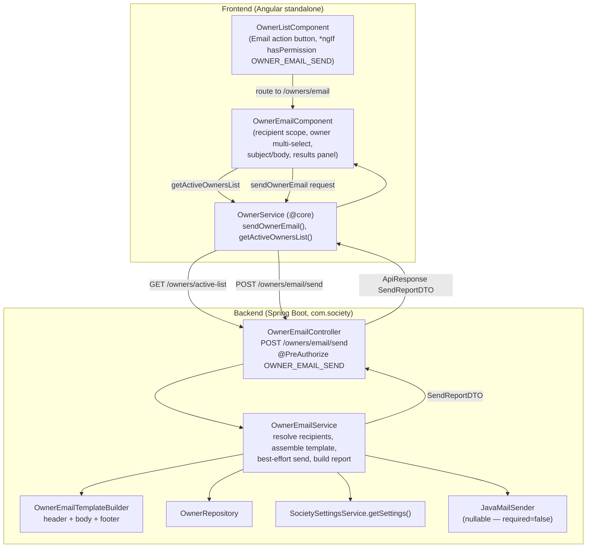
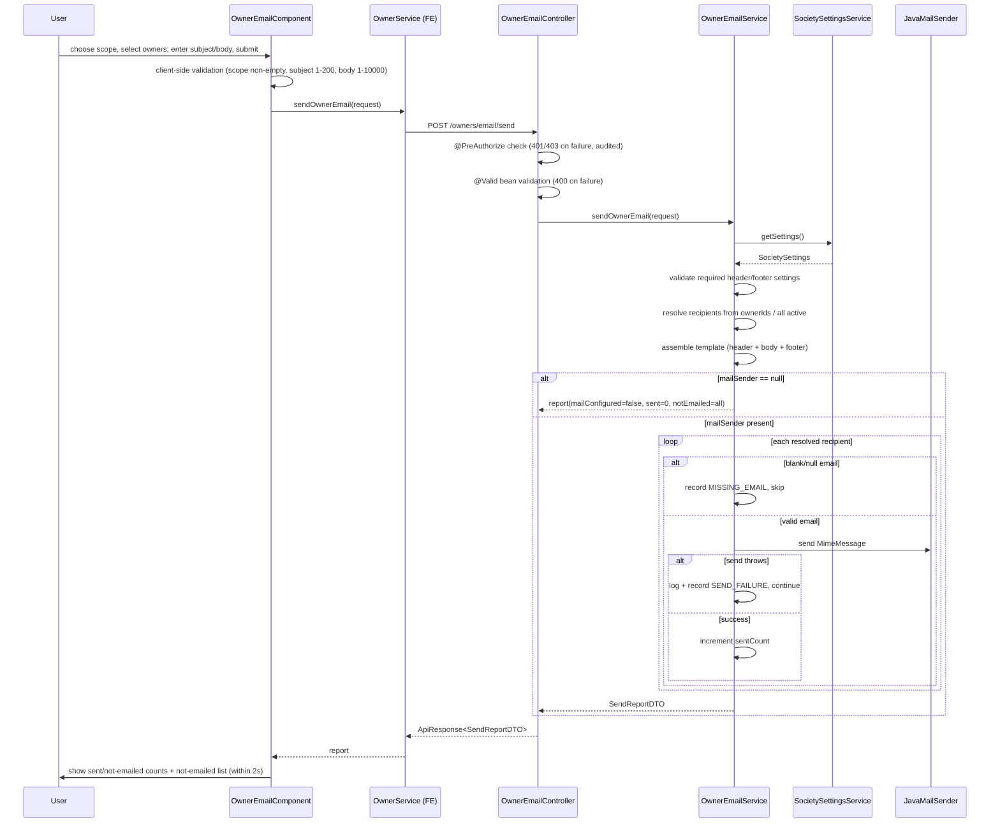

# Design Document

## Overview

The Owner Email feature adds the ability for authorized users (SUPER_ADMIN and holders of a new `OWNER_EMAIL_SEND` permission) to send a templated email to society owners — either all active owners or a manually selected subset. It surfaces as an "Email" action in the Owners module toolbar, beside the existing "Manage Unit Owners" action.

Every email is composed from a fixed three-part template applied in a strict order: a **Society Header** (society identity from `SocietySettings`), a **Body** (user-entered subject and message), and a **Footer** (signatory names from `SocietySettings`). Owners without a usable email address are excluded and reported. The feature reuses the project's established best-effort mail pattern (`TenantNotificationService`): when `JavaMailSender` is absent it degrades gracefully and reports "mail not configured" rather than failing, and a per-recipient failure never halts delivery to the remaining recipients.

The output of every send attempt is a **Send Report** whose counts are internally consistent (`sentCount + notEmailedCount == totalAttempted`) and which enumerates each not-emailed recipient with an identity and a categorized failure reason.

This design covers requirements 1–8. It grounds every component in the existing codebase conventions:

- Backend controllers return `ResponseEntity<ApiResponse<T>>` (`com.society.common.ApiResponse`).
- The Owners controller base path is `@RequestMapping("/owners")`; `getActiveOwnersList()` already exists at `GET /owners/active-list`.
- Method-level `@PreAuthorize("hasRole('SUPER_ADMIN') or hasAuthority('OWNER_EMAIL_SEND')")` guards the endpoint; the permission is seeded via `data.sql` and provisioned idempotently in `DataInitializer`.
- Mail follows `TenantNotificationService` exactly (`@Autowired(required=false) JavaMailSender`, `@Value("${spring.mail.username:noreply@society.com}")`, `MimeMessageHelper`, per-recipient try/catch, structured logging).
- Frontend uses Angular standalone components with Angular Material, routed through `owner.routes.ts`, calling `OwnerService` (`@core/services/owner.service.ts`) which returns `Observable<ApiResponse<T>>`.

## Architecture

### Component Overview



### Send Sequence



### Key Architectural Decisions

- **New controller (`OwnerEmailController`) rather than extending `OwnerController`.** Keeps the email concern cohesive and lets the whole endpoint carry a single `@PreAuthorize` guard without affecting existing owner CRUD authorization. Base path `/owners/email` keeps it in the Owners namespace. (Req 1, 6)
- **Recipient resolution on the server.** The request carries a `recipientScope` (ALL/SELECTED) plus an `ownerIds` list. For `ALL`, the service resolves the active-owner set server-side (reusing the active-owners query) so the authoritative recipient set is never trusted from the client. For `SELECTED`, the service loads exactly the requested owner IDs. (Req 2.3, 2.4, 5)
- **Best-effort mail, mirroring `TenantNotificationService`.** `JavaMailSender` is injected with `required=false`. Absence yields a graceful report; per-recipient exceptions are caught, logged, and recorded as not-emailed, never propagated. (Req 8)
- **A dedicated `OwnerEmailTemplateBuilder` helper.** Assembling header/body/footer in a single, testable unit isolates the ordering invariant and settings-field validation from the send loop. (Req 4)
- **Send report as the single response contract.** All outcomes (validation-passing sends, all-invalid, mail-not-configured, partial failure) return a `SendReportDTO` with consistent counts, so the frontend has one shape to render. (Req 5, 7, 8)

## Components and Interfaces

### Backend

#### OwnerEmailController

Location: `com.society.module.owner.controller.OwnerEmailController`

```java
@RestController
@RequestMapping("/owners/email")
@RequiredArgsConstructor
public class OwnerEmailController {

    private final OwnerEmailService ownerEmailService;

    @PostMapping("/send")
    @PreAuthorize("hasRole('SUPER_ADMIN') or hasAuthority('OWNER_EMAIL_SEND')")
    public ResponseEntity<ApiResponse<SendReportDTO>> sendOwnerEmail(
            @Valid @RequestBody SendOwnerEmailRequest request) {
        SendReportDTO report = ownerEmailService.sendOwnerEmail(request);
        return ResponseEntity.ok(ApiResponse.success("Email send processed", report));
    }
}
```

Responsibilities:
- Enforce authentication/authorization via `@PreAuthorize` (Req 6.1–6.3). Rejections surface as the standard 401/403 handled by the security layer and are audited (Req 6.4).
- Enforce request-shape validation via `@Valid` on `SendOwnerEmailRequest`; invalid subject/body are rejected with a validation error and no work is started (Req 3.5, 3.6). Handled by the existing `GlobalExceptionHandler`.
- Delegate accepted requests to `OwnerEmailService` and wrap the report in `ApiResponse.success(...)`.

#### OwnerEmailService

Location: `com.society.module.owner.service.OwnerEmailService`

```java
public interface OwnerEmailService {
    SendReportDTO sendOwnerEmail(SendOwnerEmailRequest request);
}
```

Collaborators (constructor-injected via `@RequiredArgsConstructor`, plus the nullable mail sender):

```java
@Service
@RequiredArgsConstructor
@Slf4j
public class OwnerEmailServiceImpl implements OwnerEmailService {

    @Autowired(required = false)
    private JavaMailSender mailSender;

    @Value("${spring.mail.username:noreply@society.com}")
    private String fromEmail;

    private final OwnerRepository ownerRepository;
    private final SocietySettingsService societySettingsService;
    private final OwnerEmailTemplateBuilder templateBuilder;
}
```

Responsibilities:
- **Assemble the template** using `OwnerEmailTemplateBuilder` from `SocietySettingsService.getSettings()` plus the user subject/body, validating that required header/footer settings are present (Req 4). A missing required settings field or empty subject/body causes assembly to be rejected before any send (Req 4.6, 4.7).
- **Resolve recipients** (Req 2.3, 2.4): for `SELECTED`, load owners by the provided IDs; for `ALL`, load the active-owner set.
- **Classify recipients**: an owner with a null/blank email is an `Invalid_Recipient` recorded as `MISSING_EMAIL` and never sent to (Req 5.1–5.3).
- **Best-effort send** (mirrors `TenantNotificationService`): if `mailSender == null`, send nothing and return a report with `mailConfigured=false`, `sentCount=0`, and every attempted recipient recorded as `MAIL_NOT_CONFIGURED` (Req 8.1, 8.2). Otherwise, per valid recipient, build a `MimeMessage` with `MimeMessageHelper`, catch exceptions individually, log them, record `SEND_FAILURE`, and continue (Req 8.3, 8.5).
- **Build the report** so that `sentCount + notEmailedCount == totalAttempted == resolvedRecipientCount` (Req 5.4, 7.1, 8.4). Edge cases: no recipients → all-zero report (Req 5.6); all invalid → `sentCount=0`, `notEmailedCount = attempted` (Req 5.5); zero successes → `sentCount=0` (Req 7.3).

#### OwnerEmailTemplateBuilder

Location: `com.society.module.owner.service.OwnerEmailTemplateBuilder`

```java
@Component
public class OwnerEmailTemplateBuilder {

    /** Assembles header + body + footer in that fixed order. Throws BusinessException
     *  when a required settings field or user field is missing/blank. */
    public String buildBody(SocietySettings settings, String subject, String message);

    /** The email subject line = the user-entered subject. */
    public String buildSubject(String subject);
}
```

Responsibilities:
- Produce content in the fixed order **header → body → footer** (Req 4.1). Header uses society name, address, registration number, phone, email (Req 4.2). Body uses the user subject and message (Req 4.3). Footer uses chairman, secretary, treasurer names (Req 4.4). Subject line = user subject (Req 4.5).
- Reject assembly (throw `BusinessException`, mapped by `GlobalExceptionHandler`) when a required settings field is missing/blank (Req 4.7) or the user subject/message is empty (Req 4.6).

#### Repository access

`OwnerRepository` (`com.society.module.owner.repository`) is used to:
- Fetch active owners for the `ALL` scope (reusing the active-owner query behind `getActiveOwnersList()`).
- Fetch owners by ID for the `SELECTED` scope (`findAllById(ownerIds)`).

No schema change to `Owner` is required; `email` and `fullName` are already present (email nullable), `ownerId` is the identifier.

#### Permission wiring

- **`data.sql`**: add an `OWNER_EMAIL_SEND` permission row (module `OWNER`) and grant it to the committee/admin-facing roles (e.g., CHAIRMAN, SECRETARY, COMMITTEE_MEMBER). Follow the by-name grant style used for the voucher permissions to avoid hardcoded id collisions:

  ```sql
  INSERT IGNORE INTO permissions (permission_name, module, description) VALUES
  ('OWNER_EMAIL_SEND', 'OWNER', 'Send templated emails to owners');

  INSERT IGNORE INTO role_permissions (role_id, permission_id)
  SELECT r.role_id, p.permission_id
  FROM roles r JOIN permissions p ON (
        r.role_name IN ('CHAIRMAN','SECRETARY','COMMITTEE_MEMBER')
    AND p.permission_name = 'OWNER_EMAIL_SEND');

  -- re-run SUPER_ADMIN grant-all to pick up the new permission
  INSERT IGNORE INTO role_permissions (role_id, permission_id)
  SELECT 1, permission_id FROM permissions;
  ```

- **`DataInitializer`**: add an idempotent `seedOwnerEmailSendPermission()` (mirroring `seedTransactionViewPermission`/`seedPaymentReassignPermission`) that ensures the `OWNER_EMAIL_SEND` permission exists and is granted to the committee/admin roles on every startup. This guarantees the permission is present even when `data.sql` is not applied to a given environment.

### Frontend

#### OwnerEmailComponent

Location: `frontend/src/app/modules/owner/owner-email/owner-email.component.ts` (standalone, mirroring `unit-owners.component.ts` style).

Angular Material imports: `MatCardModule`, `MatFormFieldModule`, `MatInputModule`, `MatSelectModule`, `MatCheckboxModule`, `MatTableModule`, `MatButtonModule`, `MatIconModule`, `MatProgressSpinnerModule`, `MatSnackBar`, plus `CommonModule`, `FormsModule`/`ReactiveFormsModule`.

Responsibilities:
- Render a recipient scope selector (All owners default vs Selected) (Req 2.1).
- When Selected, show a checkbox `MatTable` of active owners loaded via `getActiveOwnersList()`, supporting large lists (Req 2.2, 2.3).
- Subject input (1–200) and body textarea (1–10000) with client-side validation and inline error messages (Req 3.1–3.4).
- Block submission and show a `MatSnackBar`/inline message when: Selected scope with zero selected (Req 2.5), All scope with zero active owners (Req 2.6), empty/whitespace subject (Req 3.2), empty/whitespace body (Req 3.3), or over-length subject/body (Req 3.4). Composed content and scope are retained on block.
- On submit, call `OwnerService.sendOwnerEmail(request)` with a loading indicator and a 30-second timeout. On timeout, show an error, retain the composed message and selection, and allow retry (Req 7.6).
- On response, render a results panel within 2 seconds showing `sentCount`, `notEmailedCount`, and, when present, a table of not-emailed recipients (name/id + reason category) (Req 7.4, 7.5).

#### OwnerListComponent (entry point)

Add an Email action button beside "Manage Unit Owners", gated by permission:

```html
<a mat-raised-button routerLink="/owners/email"
   *ngIf="hasPermission('OWNER_EMAIL_SEND')"
   matTooltip="Send an email to owners">
  <mat-icon>email</mat-icon> Email
</a>
```

`hasPermission` already delegates to `AuthService.hasPermission`. When the permission is absent, the button is not rendered (Req 1.1, 1.2). Navigation to `/owners/email` lazy-loads the composition view (Req 1.3); a route/load failure keeps the current view and shows an error (Req 1.4).

#### Route

Add to `owner.routes.ts` (before the catch-all `:id` route so it is not shadowed):

```typescript
{
  path: 'email',
  loadComponent: () => import('./owner-email/owner-email.component').then(m => m.OwnerEmailComponent)
},
```

#### OwnerService additions

`@core/services/owner.service.ts`:

```typescript
sendOwnerEmail(request: SendOwnerEmailRequest): Observable<ApiResponse<SendReport>> {
  return this.http.post<ApiResponse<SendReport>>(`${this.apiUrl}/email/send`, request);
}
// getActiveOwnersList() already exists and is reused.
```

Models added to `@core/models/owner.model.ts` (see Data Models).

## Data Models

### Backend DTOs

`SendOwnerEmailRequest` (`com.society.module.owner.dto`):

```java
@Data
public class SendOwnerEmailRequest {

    @NotNull
    private RecipientScope recipientScope;   // ALL | SELECTED

    private List<Long> ownerIds;             // required (non-empty) when scope == SELECTED

    @NotBlank
    @Size(max = 200)
    private String subject;

    @NotBlank
    @Size(max = 10000)
    private String body;
}
```

`RecipientScope` enum: `ALL`, `SELECTED`.

`SendReportDTO` (`com.society.module.owner.dto`):

```java
@Data
@Builder
public class SendReportDTO {
    private int totalAttempted;
    private int sentCount;
    private int notEmailedCount;
    private boolean mailConfigured;
    private List<NotEmailedEntry> notEmailed;
}

@Data
@Builder
public class NotEmailedEntry {
    private Long ownerId;
    private String ownerName;
    private NotEmailedReason reason;   // enum category
}
```

`NotEmailedReason` enum (categorized failure reason for Req 5.3 / 7.2):
- `MISSING_EMAIL` — owner has a null/blank email address.
- `SEND_FAILURE` — mail transport threw while sending to this recipient.
- `MAIL_NOT_CONFIGURED` — `JavaMailSender` absent; nothing was sent.

Invariant across the report: `sentCount + notEmailedCount == totalAttempted` and `notEmailed.size() == notEmailedCount`.

### Frontend models

`@core/models/owner.model.ts`:

```typescript
export type RecipientScope = 'ALL' | 'SELECTED';

export type NotEmailedReason = 'MISSING_EMAIL' | 'SEND_FAILURE' | 'MAIL_NOT_CONFIGURED';

export interface SendOwnerEmailRequest {
  recipientScope: RecipientScope;
  ownerIds?: number[];        // populated when scope === 'SELECTED'
  subject: string;            // 1..200
  body: string;               // 1..10000
}

export interface NotEmailedEntry {
  ownerId: number;
  ownerName: string;
  reason: NotEmailedReason;
}

export interface SendReport {
  totalAttempted: number;
  sentCount: number;
  notEmailedCount: number;
  mailConfigured: boolean;
  notEmailed: NotEmailedEntry[];
}
```

### Data source mapping (SocietySettings → template)

| Template section | SocietySettings fields |
|---|---|
| Header (Req 4.2) | `societyName`, `addressLine1`, `addressLine2`, `city`, `state`, `pincode`, `registrationNumber`, `phone`, `email` |
| Body (Req 4.3) | user `subject`, user `body` |
| Footer (Req 4.4) | `chairmanName`, `secretaryName`, `treasurerName` |

The `Owner` entity contributes `ownerId`, `fullName`, and `email` per recipient; no entity changes are needed.

## Correctness Properties

*A property is a characteristic or behavior that should hold true across all valid executions of a system — essentially, a formal statement about what the system should do. Properties serve as the bridge between human-readable specifications and machine-verifiable correctness guarantees.*

This feature is well suited to property-based testing because recipient classification, count reconciliation, and template assembly are pure, input-varying logic with clear "for all inputs" statements. The mail transport itself and the security guard are tested via mocks/integration tests (see Testing Strategy).

The prework identified overlapping criteria that were consolidated during property reflection:
- The count invariant appears in 5.4, 7.1, and 8.4 → consolidated into a single count-invariant property.
- Recipient classification and reporting appear in 5.1, 5.2, 5.3, and 7.2 → consolidated into two properties covering classification and reporting.
- Mail-absent behavior appears in 8.1 and 8.2 → consolidated into a single mail-absent property.

### Property 1: Template ordering is always header-then-body-then-footer

*For any* valid `SocietySettings` and any non-empty subject and message, the assembled email content SHALL place the Society Header before the Body and the Body before the Footer.

**Validates: Requirements 4.1**

### Property 2: Header contains all required society identity fields

*For any* valid `SocietySettings`, the assembled Society Header SHALL contain the society name, address, registration number, phone, and email values from those settings.

**Validates: Requirements 4.2**

### Property 3: Body contains the user subject and message

*For any* non-empty subject and message, the assembled Body SHALL contain both the user-entered subject and the user-entered message content.

**Validates: Requirements 4.3, 4.5**

### Property 4: Footer contains the signatory names

*For any* valid `SocietySettings`, the assembled Footer SHALL contain the chairman, secretary, and treasurer names from those settings.

**Validates: Requirements 4.4**

### Property 5: Assembly rejects missing user or settings fields

*For any* assembly request where the subject is empty/whitespace, the message is empty/whitespace, or a required header/footer settings field is missing/blank, the template builder SHALL reject the assembly with an error identifying the offending field and SHALL send no email.

**Validates: Requirements 4.6, 4.7**

### Property 6: Send report counts reconcile with attempted recipients

*For any* resolved recipient set, the returned `SendReportDTO` SHALL satisfy `sentCount + notEmailedCount == totalAttempted`, where `totalAttempted` equals the number of resolved recipients, and `notEmailed.size() == notEmailedCount`.

**Validates: Requirements 5.4, 7.1, 8.4**

### Property 7: Only valid recipients are sent to; invalid recipients are excluded and reported

*For any* recipient set containing a mix of valid (non-blank email) and invalid (null/blank email) owners, the service SHALL invoke the mail sender only for valid recipients, SHALL never send to any invalid recipient, and SHALL record every invalid recipient in the not-emailed list with a `MISSING_EMAIL` reason.

**Validates: Requirements 5.1, 5.2, 5.3**

### Property 8: Every not-emailed recipient carries an identity and a categorized reason

*For any* send outcome, each entry in the not-emailed list SHALL contain the owner's identifier, the owner's name, and a categorized failure reason (`MISSING_EMAIL`, `SEND_FAILURE`, or `MAIL_NOT_CONFIGURED`).

**Validates: Requirements 5.3, 7.2**

### Property 9: Mail-absent yields a graceful, zero-sent report with no error

*For any* recipient set, when the `JavaMailSender` is absent the service SHALL return a report with `sentCount == 0`, `mailConfigured == false`, and `notEmailedCount == totalAttempted`, and SHALL return control normally without propagating any error.

**Validates: Requirements 8.1, 8.2**

### Property 10: A per-recipient send failure does not halt processing of the others

*For any* recipient set where an arbitrary subset of sends throws, the service SHALL still attempt delivery to every remaining valid recipient, SHALL record each failed recipient with a `SEND_FAILURE` reason, and SHALL preserve the count invariant (`sentCount + notEmailedCount == totalAttempted`).

**Validates: Requirements 8.3, 8.5**

### Property 11: Recipient scope resolution matches the requested scope

*For any* request, resolving `SELECTED` scope SHALL yield exactly the owners whose IDs were provided, and resolving `ALL` scope SHALL yield exactly the active-owner set; the request's recipient set SHALL contain exactly those resolved owners.

**Validates: Requirements 2.3, 2.4**

### Property 12: Server-side validation rejects invalid subject/body without side effects

*For any* subject that is empty/whitespace or exceeds 200 characters, or any body that is empty/whitespace or exceeds 10,000 characters, the controller SHALL reject the request with a validation error and SHALL NOT initiate any send (no partial record).

**Validates: Requirements 3.5, 3.6**

### Property 13: Client-side validation rejects invalid subject/body

*For any* subject that is empty/whitespace or exceeds 200 characters, or any body that is empty/whitespace or exceeds 10,000 characters, the component SHALL block submission and display the appropriate validation message while retaining composed content and scope.

**Validates: Requirements 3.2, 3.3, 3.4**

## Error Handling

### Backend

- **Bean validation (Req 3.5, 3.6):** `@Valid` on `SendOwnerEmailRequest` with `@NotBlank`/`@Size(max=200)` on `subject` and `@NotBlank`/`@Size(max=10000)` on `body`; `@NotNull` on `recipientScope`. Violations are translated to a 400 validation error by the existing `GlobalExceptionHandler` before the service runs, so no partial record is created.
- **Missing settings / empty user fields (Req 4.6, 4.7):** `OwnerEmailTemplateBuilder` throws `BusinessException` identifying the specific missing field; `GlobalExceptionHandler` maps it to a client-facing error. Assembly failure occurs before any send, so nothing is dispatched.
- **Mail transport absent (Req 8.1, 8.2):** `mailSender == null` is handled explicitly — no send is attempted, the report is returned with `mailConfigured=false`, and control returns normally (no exception).
- **Per-recipient send failure (Req 8.3, 8.5):** each `mailSender.send(...)` is wrapped in try/catch inside the loop (mirroring `TenantNotificationService`); the exception is logged at `error` with the owner id and error message, the recipient is recorded as `SEND_FAILURE`, and the loop continues.
- **Authorization/authentication (Req 6):** enforced by `@PreAuthorize`; the security layer returns 401/403 and records the rejection in the audit log. The service is never invoked on rejection.
- **Selected scope with empty/absent `ownerIds`:** treated as zero recipients server-side, producing an all-zero report (Req 5.6) — the primary block for this case is client-side (Req 2.5).

### Frontend

- **Blocked submissions (Req 2.5, 2.6, 3.2–3.4):** submit is disabled/short-circuited and an inline message or `MatSnackBar` explains the reason; composed content and scope are retained.
- **Send timeout (Req 7.6):** the `sendOwnerEmail` call uses RxJS `timeout(30000)`; on timeout the component shows an error, retains the message and recipient selection, and re-enables the submit button for retry.
- **Composition view load failure (Req 1.4):** a lazy-load/navigation error is caught so the current Owners view is retained and an error indication is shown.
- **API error responses:** non-success `ApiResponse` payloads surface the `message` via `MatSnackBar`.

## Security and Authorization

- **Endpoint guard (Req 6.1–6.3):** `@PreAuthorize("hasRole('SUPER_ADMIN') or hasAuthority('OWNER_EMAIL_SEND')")` on `POST /owners/email/send`. Unauthenticated → 401; authenticated without the permission → 403; authorized → processed. This mirrors the established pattern (e.g., `TransactionController`, `VoucherController`).
- **New permission `OWNER_EMAIL_SEND`:** seeded in `data.sql` (module `OWNER`) and provisioned idempotently in `DataInitializer` (`seedOwnerEmailSendPermission`), granted to committee/admin roles (CHAIRMAN, SECRETARY, COMMITTEE_MEMBER); SUPER_ADMIN is covered by the grant-all re-run and by `hasRole('SUPER_ADMIN')`.
- **Frontend gating (Req 1.1, 1.2):** the Email action is rendered only when `AuthService.hasPermission('OWNER_EMAIL_SEND')`. This is a UX convenience; the server-side guard remains the authoritative control.
- **Server-side recipient resolution:** the authoritative recipient set is resolved on the server from `ownerIds` (SELECTED) or the active-owner query (ALL); the client cannot inject recipients beyond selecting from active owners.
- **Audit logging (Req 6.4):** authentication/authorization rejections are recorded in the application audit log by the security layer.
- **PII handling:** owner emails are used only as send targets and are not echoed back in the `SendReportDTO`; not-emailed entries expose only owner id, name, and a reason category.

## Testing Strategy

A dual approach: property-based tests verify the universal logic properties above; unit, component, and integration tests cover specific examples, edge cases, security, and infrastructure wiring.

### Property-Based Tests (backend)

- Library: **jqwik** (already present in the backend — see `backend/.jqwik-database`). Do not implement PBT from scratch.
- Each property test runs a **minimum of 100 iterations** (`@Property(tries = 100)` or higher).
- Each test is tagged with a comment referencing its design property, using the format: **Feature: owner-email, Property {number}: {property_text}**.
- Each of the 12 backend correctness properties (Properties 1–12) is implemented by a **single** property-based test:
  - Properties 1–5: exercise `OwnerEmailTemplateBuilder` with generated `SocietySettings`, subjects, and messages (including whitespace-only and over-length generators for Property 5's rejection paths and Property 12's boundaries).
  - Properties 6, 7, 8, 10: exercise `OwnerEmailServiceImpl` with a **mocked** `JavaMailSender` and generated recipient sets mixing valid/invalid emails; a generated subset of sends is made to throw for Property 10.
  - Property 9: same service with `mailSender = null`.
  - Property 11: recipient-resolution logic with generated active-owner sets and selected-id subsets.
  - Property 12: controller/validation boundary via generated invalid subjects/bodies, asserting the service is never invoked.
- Property 13 (client-side validation) is implemented as an Angular property-style test using generated strings (whitespace-only, over-length) via a small generator; if a JS PBT library (e.g., fast-check) is available it is used, otherwise a parameterized table of representative generated cases covers the boundaries.

### Unit / Component / Edge-Case Tests

- **Backend edge cases:** empty recipient set → all-zero report (Req 5.6); all-invalid recipients → `sentCount=0` (Req 5.5); zero successful sends → `sentCount=0` (Req 7.3); `MimeMessageHelper` construction uses `fromEmail` from `spring.mail.username`.
- **Frontend component tests:** Email button visible/hidden by permission (Req 1.1, 1.2); default scope = ALL (Req 2.1); selected-with-none blocked (Req 2.5); all-scope-with-zero-owners blocked (Req 2.6); subject/body input bounds and validation messages (Req 3.1–3.4); results panel renders counts and not-emailed list (Req 7.4, 7.5); 30s timeout handling and retry (Req 7.6); composition-view load failure handling (Req 1.4).

### Integration Tests

- **Security (Req 6):** `@SpringBootTest` + `MockMvc` against the seeded database — unauthenticated → 401 (Req 6.1); authenticated without permission → 403 (Req 6.2); with `OWNER_EMAIL_SEND` → processed (Req 6.3); rejection recorded in the audit log (Req 6.4). These verify the `@PreAuthorize` guard and envelope end-to-end and are not property tests (behavior does not vary meaningfully with input).
- **Wiring:** one end-to-end send with a mocked/greenmail mail server verifying header→body→footer content reaches the transport and a partial-failure produces the expected report shape.
- **Permission provisioning:** startup test asserting `DataInitializer` creates `OWNER_EMAIL_SEND` and grants it to the intended roles.
