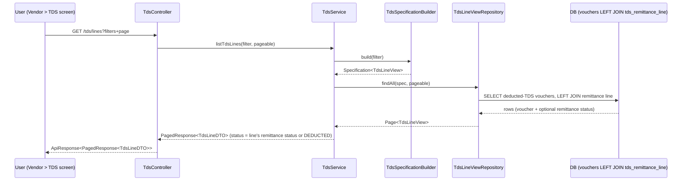
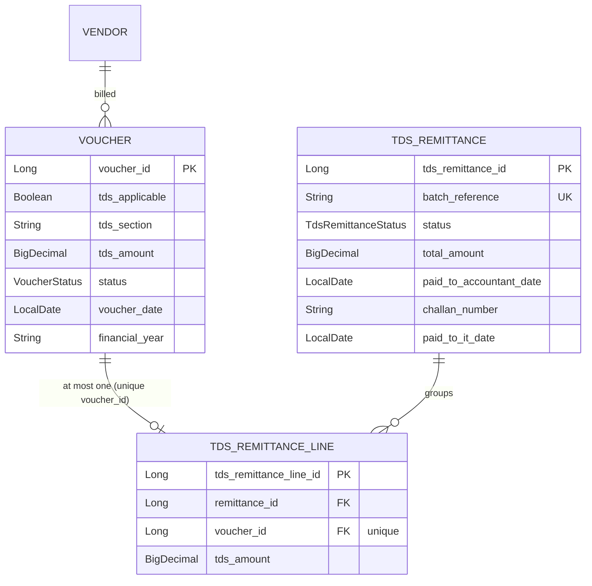
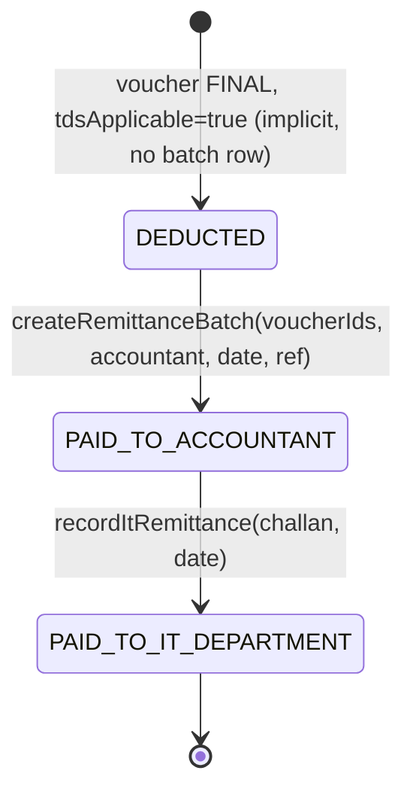

# Design Document: Vendor TDS Management

## Overview

The Vendor TDS Management module gives the society a single, filterable view of every rupee of TDS (Tax Deducted at Source) it has deducted from vendor payments, together with a two-stage remittance lifecycle that tracks money as it moves from the society to its accountant, and then from the accountant to the Income Tax Department on the society's behalf.

TDS is *already* deducted at voucher time. Each `Voucher` of `VoucherType.PAYMENT` to a vendor already carries `tdsApplicable`, `tdsSection`, `tdsRate`, `tdsAmount`, and `netPayable`, auto-calculated by `TdsConfigService.calculateTds(...)`. What the system lacks is (a) an aggregated read model that lists deducted-TDS across all vendors with a remittance status, and (b) a persistent record of the remittance lifecycle, because the `Voucher` only knows the amount deducted, not whether that amount has been handed to the accountant or remitted to the IT Department.

This feature adds a dedicated `com.society.module.tds` sub-package that: introduces a new `TdsRemittance` entity (a *batch* grouping one or more deducted-TDS voucher lines), a `TdsRemittanceStatus` enum, a JPA `Specification`-based filter over the deducted-TDS read model (date-wise, vendor-wise, status-wise, section, financial year), summary totals, and status-transition actions with recorded challan/reference/date/actor. The Angular UI is a TDS screen reachable from the Vendor module, with a filterable table, status badges, summary cards, and PDF export following the existing `VendorLedgerPdfService` pattern.

### Why a dedicated `com.society.module.tds` package (not inside `com.society.module.vendor`)

TDS data spans two existing aggregates — it *reads* deducted amounts from `Voucher` (voucher module) and references `Vendor` (vendor module). Placing it in `vendor` would force the vendor module to depend on voucher internals; placing it in `voucher` would bury a tax/compliance concern inside payment plumbing. A dedicated `tds` module keeps the compliance lifecycle cohesive and lets both vendor and voucher modules stay unaware of remittance state. The UI is still *discoverable from the Vendor module* (a "TDS" tab/link routes into the TDS screen), satisfying the user's "implement into the Vendor module" intent at the navigation level while keeping backend boundaries clean.

## Architecture

The module follows the established per-module layout (`controller/`, `dto/`, `entity/`, `repository/`, `service/`, `specification/`). The **deducted-TDS list** is a *read model* projected from `FINAL` payment vouchers where `tdsApplicable = true`; the **remittance lifecycle** is *write model* state stored in the new `TdsRemittance` (batch) and `TdsRemittanceLine` (per-voucher link) entities.

```mermaid
graph TD
    subgraph Frontend["Angular - reachable from Vendor module"]
        UI_LIST[TDS List + Filters]
        UI_SUMMARY[Summary Cards]
        UI_ACTIONS[Status Transition Dialogs]
        UI_PDF[PDF Export]
    end

    subgraph API["com.society.module.tds.controller"]
        TC[TdsController]
    end

    subgraph SVC["com.society.module.tds.service"]
        TS[TdsService]
        TRS[TdsRemittanceService]
        TPDF[TdsReportPdfService]
    end

    subgraph SPEC["com.society.module.tds.specification"]
        TSB[TdsSpecificationBuilder]
    end

    subgraph REPO["com.society.module.tds.repository"]
        TLR[TdsLineViewRepository]
        TRR[TdsRemittanceRepository]
    end

    subgraph DB[(Database)]
        V[(vouchers - existing)]
        VEN[(vendors - existing)]
        TR[(tds_remittance - new)]
        TRL[(tds_remittance_line - new)]
    end

    UI_LIST --> TC
    UI_SUMMARY --> TC
    UI_ACTIONS --> TC
    UI_PDF --> TC
    TC --> TS
    TC --> TRS
    TC --> TPDF
    TS --> TSB
    TSB --> TLR
    TS --> TLR
    TRS --> TRR
    TRS --> TLR
    TLR --> V
    TLR --> TRL
    TLR --> VEN
    TRR --> TR
    TRR --> TRL
    TR --> TRL
    TRL --> V
```

### Data-flow: how a deducted-TDS line gets a status



### Remittance approach: BATCH (recommended) vs per-voucher

**Recommended: batch remittance.** In practice a society pays its accountant a single lump sum covering many vouchers, and the accountant files one challan with the IT Department covering many deductions. Modeling this as a `TdsRemittance` *batch* that groups multiple `TdsRemittanceLine` rows (each pointing at one source voucher) mirrors reality: one challan number, one payment date, one actor per transition, applied atomically to every line in the batch. Summary math stays exact because each voucher's `tdsAmount` is linked to exactly one line at most.

**Alternative: per-voucher tracking.** Every deducted-TDS voucher would carry its own status columns directly (e.g., add remittance fields to `Voucher`). This is simpler to query but (1) pollutes the payment aggregate with tax-remittance state, (2) cannot represent "one challan covers 40 vouchers" without duplicating challan data 40 times, and (3) makes it impossible to record a single actor/date/reference for a real-world batch remittance. The batch model is chosen; a per-voucher view is still trivially available because each line links back to its voucher (the read model is line-grained).

**Invariant enforced by the schema:** a source voucher may belong to **at most one** `TdsRemittanceLine` (unique constraint on `voucher_id`). A voucher with no line is implicitly `DEDUCTED`.

## Data Models

### New enum: `TdsRemittanceStatus` (in `com.society.enums`)

```java
package com.society.enums;

/**
 * Two-stage remittance lifecycle for deducted TDS.
 * Ordinal order encodes forward-only progression: DEDUCTED(0) -> PAID_TO_ACCOUNTANT(1) -> PAID_TO_IT_DEPARTMENT(2).
 */
public enum TdsRemittanceStatus {
    DEDUCTED,             // TDS deducted at voucher payment; not yet handed to accountant (implicit default)
    PAID_TO_ACCOUNTANT,   // Society has paid the TDS amount to the accountant
    PAID_TO_IT_DEPARTMENT // Accountant has remitted to the Income Tax Department on behalf of the society
}
```

`DEDUCTED` is never persisted on a `TdsRemittance` row — a batch exists only once money leaves the society. A deducted-TDS voucher with **no** remittance line is reported as `DEDUCTED` by the read model. The persisted statuses on a batch are `PAID_TO_ACCOUNTANT` and `PAID_TO_IT_DEPARTMENT`.

### New entity: `TdsRemittance` (batch) — `com.society.module.tds.entity`

```java
@Entity
@Table(name = "tds_remittance")
@Getter @Setter @NoArgsConstructor @AllArgsConstructor @Builder
public class TdsRemittance extends BaseEntity {

    @Id
    @GeneratedValue(strategy = GenerationType.IDENTITY)
    @Column(name = "tds_remittance_id")
    private Long tdsRemittanceId;

    @Column(name = "batch_reference", nullable = false, unique = true, length = 30)
    private String batchReference;                 // e.g. "TDS-2024-0001"

    @Enumerated(EnumType.STRING)
    @Column(name = "status", nullable = false)
    private TdsRemittanceStatus status;            // PAID_TO_ACCOUNTANT or PAID_TO_IT_DEPARTMENT

    @Column(name = "financial_year", nullable = false, length = 10)
    private String financialYear;

    @Column(name = "total_amount", nullable = false, precision = 12, scale = 2)
    private BigDecimal totalAmount;                // = sum of linked voucher tdsAmount, HALF_UP scale 2

    // --- Stage 1: society -> accountant ---
    @Column(name = "accountant_name", length = 100)
    private String accountantName;
    @Column(name = "paid_to_accountant_date")
    private LocalDate paidToAccountantDate;
    @Column(name = "accountant_reference", length = 100)
    private String accountantReference;            // internal payment/transfer reference
    @Column(name = "paid_to_accountant_by", length = 100)
    private String paidToAccountantBy;             // actor who recorded stage 1

    // --- Stage 2: accountant -> IT Department ---
    @Column(name = "challan_number", length = 50)
    private String challanNumber;                  // IT Dept challan (CIN)
    @Column(name = "paid_to_it_date")
    private LocalDate paidToItDate;
    @Column(name = "paid_to_it_by", length = 100)
    private String paidToItBy;                     // actor who recorded stage 2

    @Column(name = "remarks", columnDefinition = "TEXT")
    private String remarks;

    @OneToMany(mappedBy = "remittance", cascade = CascadeType.ALL, orphanRemoval = true)
    @Builder.Default
    private List<TdsRemittanceLine> lines = new ArrayList<>();
}
```

### New entity: `TdsRemittanceLine` (voucher link) — `com.society.module.tds.entity`

```java
@Entity
@Table(name = "tds_remittance_line",
       uniqueConstraints = @UniqueConstraint(name = "uk_tds_line_voucher", columnNames = "voucher_id"))
@Getter @Setter @NoArgsConstructor @AllArgsConstructor @Builder
public class TdsRemittanceLine extends BaseEntity {

    @Id
    @GeneratedValue(strategy = GenerationType.IDENTITY)
    @Column(name = "tds_remittance_line_id")
    private Long tdsRemittanceLineId;

    @ManyToOne(fetch = FetchType.LAZY, optional = false)
    @JoinColumn(name = "remittance_id", nullable = false)
    private TdsRemittance remittance;

    // Source of truth for the deducted amount. Unique => a voucher joins at most one batch.
    @ManyToOne(fetch = FetchType.LAZY, optional = false)
    @JoinColumn(name = "voucher_id", nullable = false, unique = true)
    private Voucher voucher;

    // Snapshot of the deducted TDS amount at batch time (defends against later voucher edits).
    @Column(name = "tds_amount", nullable = false, precision = 12, scale = 2)
    private BigDecimal tdsAmount;
}
```

### Relationship diagram



### DB migration notes

- Create table `tds_remittance` and `tds_remittance_line` (both include `BaseEntity` audit columns: `created_by`, `created_on`, `modified_by`, `modified_on`).
- `tds_remittance_line.voucher_id` gets a **UNIQUE** constraint (`uk_tds_line_voucher`) — this is the schema-level guarantee that TDS cannot be double-remitted.
- Foreign keys: `tds_remittance_line.remittance_id -> tds_remittance(tds_remittance_id)` (ON DELETE handled by JPA `orphanRemoval`), `tds_remittance_line.voucher_id -> vouchers(voucher_id)`.
- Indexes: `idx_tds_remittance_fy_status (financial_year, status)`; `idx_tds_line_voucher (voucher_id)` (covered by unique); the read model benefits from existing voucher indexes plus a composite on `vouchers(tds_applicable, status, voucher_date)`.
- No change to the existing `vouchers` table schema. This module is purely additive.

### Read model: `TdsLineView`

The list screen reads a per-voucher projection. Preferred implementation is a JPA entity mapped to a database **view** (or an `@Immutable` read-only entity) named `tds_line_view` so a `Specification` can filter it uniformly. It projects one row per deducted-TDS voucher:

```sql
CREATE VIEW tds_line_view AS
SELECT v.voucher_id            AS voucher_id,
       v.voucher_number        AS voucher_number,
       v.voucher_date          AS deduction_date,
       v.financial_year        AS financial_year,
       v.tds_section           AS tds_section,
       v.tds_rate              AS tds_rate,
       v.tds_amount            AS tds_amount,
       v.vendor_id             AS vendor_id,
       ven.vendor_name         AS vendor_name,
       l.remittance_id         AS remittance_id,
       COALESCE(r.status, 'DEDUCTED') AS remittance_status,
       r.paid_to_accountant_date AS paid_to_accountant_date,
       r.paid_to_it_date       AS paid_to_it_date,
       r.challan_number        AS challan_number
FROM vouchers v
JOIN vendors ven               ON ven.vendor_id = v.vendor_id
LEFT JOIN tds_remittance_line l ON l.voucher_id = v.voucher_id
LEFT JOIN tds_remittance r      ON r.tds_remittance_id = l.remittance_id
WHERE v.tds_applicable = true
  AND v.tds_amount IS NOT NULL
  AND v.tds_amount > 0
  AND v.status = 'FINAL'
  AND v.vendor_id IS NOT NULL;
```

Mapping this view to an `@Entity @Immutable TdsLineView` lets `TdsSpecificationBuilder` build a `Specification<TdsLineView>` exactly like `TransactionSpecificationBuilder`. (If a DB view is undesirable, the same projection can be a read-only entity over `Voucher` with a mapped `@OneToOne` to `TdsRemittanceLine`; the `Specification` shape is unchanged.)

## Remittance State Machine

Status progression is **forward-only**. A batch is created directly in `PAID_TO_ACCOUNTANT` (stage 1 recorded at creation) and later advances to `PAID_TO_IT_DEPARTMENT`.



### Valid transitions

| From | To | Trigger | Recorded |
|------|----|---------|----------|
| `DEDUCTED` (no batch) | `PAID_TO_ACCOUNTANT` | Create batch from selected deducted voucher lines | accountantName, paidToAccountantDate, accountantReference, actor |
| `PAID_TO_ACCOUNTANT` | `PAID_TO_IT_DEPARTMENT` | Record IT Dept remittance on an existing batch | challanNumber, paidToItDate, actor |

### Forbidden transitions (rejected with `BusinessException`)

- Any backward move (e.g., `PAID_TO_IT_DEPARTMENT -> PAID_TO_ACCOUNTANT`, `PAID_TO_ACCOUNTANT -> DEDUCTED`).
- Skipping a stage (a batch cannot be created directly in `PAID_TO_IT_DEPARTMENT` — IT remittance requires an existing `PAID_TO_ACCOUNTANT` batch).
- Adding a voucher to a batch when that voucher already belongs to a line (guarded by the unique constraint and pre-checked in the service).
- Creating a batch from a voucher that is not `FINAL`, not `tdsApplicable`, or has `tdsAmount <= 0`.

### Transition guard (pseudocode-as-Java)

```java
private void assertForwardTransition(TdsRemittanceStatus from, TdsRemittanceStatus to) {
    if (to.ordinal() <= from.ordinal()) {
        throw new BusinessException(
            "Invalid TDS status transition: " + from + " -> " + to + " (must move forward)");
    }
    if (to.ordinal() != from.ordinal() + 1) {
        throw new BusinessException(
            "Cannot skip TDS remittance stage: " + from + " -> " + to);
    }
}
```

## Components and Interfaces

### `TdsService` — deducted-TDS read model + summary

```java
public interface TdsService {
    /** Filtered, paginated list of deducted-TDS lines across all vendors. */
    PagedResponse<TdsLineDTO> listTdsLines(TdsFilterRequest filter, Pageable pageable);

    /** Aggregated totals over the SAME filtered set (deducted, to-accountant, to-IT, pending). */
    TdsSummaryDTO summarize(TdsFilterRequest filter);
}
```

### `TdsRemittanceService` — lifecycle write model

```java
public interface TdsRemittanceService {
    /** Stage 1: group selected deducted vouchers into a PAID_TO_ACCOUNTANT batch. */
    TdsRemittanceDTO createBatch(CreateRemittanceRequest request);

    /** Stage 2: advance an existing batch to PAID_TO_IT_DEPARTMENT. */
    TdsRemittanceDTO recordItRemittance(Long remittanceId, RecordItRemittanceRequest request);

    TdsRemittanceDTO getBatch(Long remittanceId);

    PagedResponse<TdsRemittanceDTO> listBatches(TdsFilterRequest filter, Pageable pageable);
}
```

**Responsibilities**: validate eligibility of each voucher (FINAL, tdsApplicable, tdsAmount>0, not already lined), compute `totalAmount` as the `HALF_UP` scale-2 sum of snapshot `tdsAmount`s, generate a `batchReference`, enforce the forward-only guard, and persist audit actor via `BaseEntity`.

### `TdsReportPdfService`

```java
public interface TdsReportPdfService {
    /** Renders the filtered TDS list + summary to PDF (same iText/OpenPDF pattern as VendorLedgerPdfService). */
    byte[] generateTdsReportPdf(TdsFilterRequest filter) throws IOException;
}
```

## Data Transfer Objects

```java
// Filter request — binds query params; absent/blank fields contribute no predicate.
@Data
public class TdsFilterRequest {
    private LocalDate deductionStartDate;   // filter on voucher_date >=
    private LocalDate deductionEndDate;     // filter on voucher_date <=
    private LocalDate remittanceStartDate;  // filter on paid_to_it_date / paid_to_accountant_date >=
    private LocalDate remittanceEndDate;    // <=
    private Long vendorId;                   // vendor-wise
    private String vendorSearch;             // case-insensitive contains on vendor_name
    private List<TdsRemittanceStatus> statuses; // multi-value, IN(...)
    private String tdsSection;               // e.g. "194C"
    private String financialYear;            // e.g. "2024-2025"
}

// One row of the deducted-TDS list.
@Data @Builder
public class TdsLineDTO {
    private Long voucherId;
    private String voucherNumber;
    private LocalDate deductionDate;
    private String financialYear;
    private Long vendorId;
    private String vendorName;
    private String tdsSection;
    private BigDecimal tdsRate;
    private BigDecimal tdsAmount;
    private TdsRemittanceStatus status;      // DEDUCTED if no batch
    private Long remittanceId;               // null when DEDUCTED
    private String challanNumber;            // null until PAID_TO_IT_DEPARTMENT
    private LocalDate paidToAccountantDate;
    private LocalDate paidToItDate;
}

// Summary totals over the filtered set.
@Data @Builder
public class TdsSummaryDTO {
    private BigDecimal totalDeducted;        // sum of all lines in scope
    private BigDecimal totalPaidToAccountant;// lines whose status >= PAID_TO_ACCOUNTANT
    private BigDecimal totalPaidToItDept;    // lines whose status == PAID_TO_IT_DEPARTMENT
    private BigDecimal totalPending;         // totalDeducted - totalPaidToItDept
    private long lineCount;
}

@Data @Builder
public class TdsRemittanceDTO {
    private Long remittanceId;
    private String batchReference;
    private TdsRemittanceStatus status;
    private String financialYear;
    private BigDecimal totalAmount;
    private String accountantName;
    private LocalDate paidToAccountantDate;
    private String accountantReference;
    private String challanNumber;
    private LocalDate paidToItDate;
    private String remarks;
    private List<TdsLineDTO> lines;
}

@Data
public class CreateRemittanceRequest {
    @NotEmpty private List<Long> voucherIds;
    @NotBlank private String accountantName;
    @NotNull  private LocalDate paidToAccountantDate;
    private String accountantReference;
    private String remarks;
}

@Data
public class RecordItRemittanceRequest {
    @NotBlank private String challanNumber;
    @NotNull  private LocalDate paidToItDate;
    private String remarks;
}
```

**Validation rules**:
- `CreateRemittanceRequest.voucherIds` non-empty; each id must resolve to an eligible voucher (else `BusinessException` listing offending ids).
- Money aggregation uses `RoundingMode.HALF_UP`, scale 2.
- `financialYear` on a batch derived from the linked vouchers; batch rejects mixing vouchers from different financial years (keeps IT challans FY-consistent).

## API Endpoints

All endpoints live on `TdsController` (`@RequestMapping("/tds")`), return `ApiResponse<T>` / `PagedResponse<T>`, and use `@DateTimeFormat(iso = DATE)` for `LocalDate` query params (matching `VendorController`).

| Method | Path | Purpose | Response |
|--------|------|---------|----------|
| `GET` | `/tds/lines` | Filtered, paginated deducted-TDS list | `ApiResponse<PagedResponse<TdsLineDTO>>` |
| `GET` | `/tds/summary` | Totals over the same filter | `ApiResponse<TdsSummaryDTO>` |
| `GET` | `/tds/lines/pdf` | Filtered list + summary as PDF | `ResponseEntity<byte[]>` |
| `GET` | `/tds/remittances` | Filtered, paginated remittance batches | `ApiResponse<PagedResponse<TdsRemittanceDTO>>` |
| `GET` | `/tds/remittances/{id}` | Single batch with lines | `ApiResponse<TdsRemittanceDTO>` |
| `POST` | `/tds/remittances` | Stage 1: create batch (DEDUCTED -> PAID_TO_ACCOUNTANT) | `ApiResponse<TdsRemittanceDTO>` (201) |
| `PATCH` | `/tds/remittances/{id}/it-remittance` | Stage 2: record IT Dept remittance | `ApiResponse<TdsRemittanceDTO>` |

Query params for `/tds/lines`, `/tds/summary`, `/tds/lines/pdf`, `/tds/remittances`: `deductionStartDate`, `deductionEndDate`, `remittanceStartDate`, `remittanceEndDate`, `vendorId`, `vendorSearch`, `statuses` (repeatable), `tdsSection`, `financialYear`, plus `page`/`size` for paginated endpoints.

### Controller signature sketch

```java
@GetMapping("/lines")
public ResponseEntity<ApiResponse<PagedResponse<TdsLineDTO>>> listLines(
        @ModelAttribute TdsFilterRequest filter,
        @RequestParam(defaultValue = "0") int page,
        @RequestParam(defaultValue = "20") int size) {
    return ResponseEntity.ok(ApiResponse.success(
            tdsService.listTdsLines(filter, PageRequest.of(page, size))));
}
```

## Filter Specification Design

`TdsSpecificationBuilder` follows `TransactionSpecificationBuilder` exactly: an empty/blank field contributes **no predicate**, multi-value `statuses` uses `IN(...)`, and everything is combined with `cb.and(...)` so the result set can only ever **narrow** relative to the unfiltered scope.

```java
@Component
public class TdsSpecificationBuilder {

    public Specification<TdsLineView> build(TdsFilterRequest f) {
        return (root, query, cb) -> {
            List<Predicate> predicates = new ArrayList<>();

            // Deduction date range (voucher_date), inclusive
            if (f.getDeductionStartDate() != null)
                predicates.add(cb.greaterThanOrEqualTo(root.get("deductionDate"), f.getDeductionStartDate()));
            if (f.getDeductionEndDate() != null)
                predicates.add(cb.lessThanOrEqualTo(root.get("deductionDate"), f.getDeductionEndDate()));

            // Remittance date range: match either stage date within [start,end]
            if (f.getRemittanceStartDate() != null)
                predicates.add(cb.or(
                    cb.greaterThanOrEqualTo(root.get("paidToAccountantDate"), f.getRemittanceStartDate()),
                    cb.greaterThanOrEqualTo(root.get("paidToItDate"), f.getRemittanceStartDate())));
            if (f.getRemittanceEndDate() != null)
                predicates.add(cb.or(
                    cb.lessThanOrEqualTo(root.get("paidToAccountantDate"), f.getRemittanceEndDate()),
                    cb.lessThanOrEqualTo(root.get("paidToItDate"), f.getRemittanceEndDate())));

            // Vendor-wise
            if (f.getVendorId() != null)
                predicates.add(cb.equal(root.get("vendorId"), f.getVendorId()));
            if (StringUtils.hasText(f.getVendorSearch()))
                predicates.add(cb.like(cb.lower(root.get("vendorName")),
                        "%" + f.getVendorSearch().toLowerCase() + "%"));

            // Status: OR within, AND with rest
            if (f.getStatuses() != null && !f.getStatuses().isEmpty())
                predicates.add(root.get("remittanceStatus").in(f.getStatuses()));

            // TDS section
            if (StringUtils.hasText(f.getTdsSection()))
                predicates.add(cb.equal(root.get("tdsSection"), f.getTdsSection()));

            // Financial year
            if (StringUtils.hasText(f.getFinancialYear()))
                predicates.add(cb.equal(root.get("financialYear"), f.getFinancialYear()));

            return cb.and(predicates.toArray(new Predicate[0]));
        };
    }
}
```

The summary reuses the **same** specification (over the same `TdsLineView`), so totals always reflect exactly the rows the list shows.

## Frontend Components (Angular)

Under `frontend/src/app/modules/` add a `tds/` feature, routed and linked from the Vendor module (a "TDS" tab/menu entry in the vendor area).

- **`TdsListComponent`** — filterable table of `TdsLineDTO`. Filter bar: deduction date range, remittance date range, vendor picker (from `/vendors/active-list`), status multi-select, TDS section, financial year. Columns: voucher no, vendor, section, rate, TDS amount, deduction date, status badge, challan no.
- **`TdsSummaryCardsComponent`** — cards for Total Deducted, Paid to Accountant, Paid to IT Dept, Pending (from `/tds/summary`, recomputed on filter change).
- **`TdsStatusBadgeComponent`** — colored badge: `DEDUCTED` (grey), `PAID_TO_ACCOUNTANT` (amber), `PAID_TO_IT_DEPARTMENT` (green).
- **`CreateRemittanceDialogComponent`** — select deducted lines, capture accountant name/date/reference; calls `POST /tds/remittances`.
- **`RecordItRemittanceDialogComponent`** — capture challan number + date; calls `PATCH /tds/remittances/{id}/it-remittance`.
- **`TdsService` (Angular)** — typed HTTP wrappers; serializes filters to query params; PDF download via blob from `/tds/lines/pdf`.

## Error Handling

Errors flow through the existing `GlobalExceptionHandler`, returning `ApiResponse.error(message)`.

| Scenario | Condition | Response | Recovery |
|----------|-----------|----------|----------|
| Ineligible voucher in batch | voucher not FINAL / not tdsApplicable / tdsAmount<=0 | `BusinessException` -> 400, message lists offending voucher ids | User removes those lines and retries |
| Voucher already remitted | `voucher_id` already in a line (unique violation / pre-check) | `BusinessException` -> 400 | Refresh list; line already shows a status |
| Mixed financial years in batch | linked vouchers span >1 FY | `BusinessException` -> 400 | Split into per-FY batches |
| Invalid status transition | backward or stage-skipping move | `BusinessException` -> 400 | Only forward transitions allowed |
| Batch not found | unknown `remittanceId` | `ResourceNotFoundException` -> 404 | Reload batch list |
| IT remittance on non-accountant batch | batch not in `PAID_TO_ACCOUNTANT` | `BusinessException` -> 400 | Record accountant stage first |

## Testing Strategy

### Unit testing approach
Example-based tests for: state-machine guard (each valid + each forbidden transition), batch total computation with `HALF_UP` rounding, eligibility validation (each rejection reason), summary math on a fixed small dataset, and DTO mapping. Edge cases: empty filter, single line, line with exactly `tdsAmount = 0.005` rounding boundary.

### Property-based testing approach
The read model, filter specification, and summary math are pure, input-driven functions with strong universal invariants — ideal for property testing. Focus areas: forward-only transitions, conservation of money (remitted + pending = deducted), and the filter-narrowing invariant.

**Property test library**: **jqwik** (already present in the backend — see `backend/.jqwik-database`), integrated with JUnit 5. Minimum 100 iterations per property; each test tagged `Feature: vendor-tds-management, Property N: <text>`.

### Integration testing approach
`@DataJpaTest` repository tests over `tds_line_view` and the unique constraint on `voucher_id`; a `@SpringBootTest` slice for the two transition endpoints verifying persisted actor/date/reference and 400s on forbidden transitions.

## Correctness Properties

*A property is a characteristic or behavior that should hold true across all valid executions of a system — a formal statement about what the system should do. Properties bridge human-readable specifications and machine-verifiable correctness guarantees.*

### Property 1: Status transitions only move forward

*For any* remittance batch and any attempted status transition, the transition succeeds only if the target status is exactly one stage ahead of the current status; every backward or stage-skipping transition is rejected and leaves the batch status unchanged.

**Validates: Requirements 7.1, 7.2, 7.3**

### Property 2: Money is conserved (remitted + pending = deducted)

*For any* filtered set of deducted-TDS lines, `totalPaidToItDept + totalPending` equals `totalDeducted`, and `0 <= totalPaidToItDept <= totalPaidToAccountant <= totalDeducted`.

**Validates: Requirements 4.2, 4.3, 4.4, 4.5**

### Property 3: Filters never widen the result set

*For any* base filter and any additional non-blank filter field added to it, the number of lines returned by the more-specific filter is less than or equal to the number returned by the base filter (monotonic narrowing); the empty filter returns the full scoped set.

**Validates: Requirements 2.1, 2.2, 2.13**

### Property 4: A voucher is remitted at most once

*For any* sequence of batch-creation operations, each source voucher appears in at most one `TdsRemittanceLine`; attempting to include an already-lined voucher is rejected.

**Validates: Requirements 7.4, 5.5**

### Property 5: Batch total equals sum of its lines

*For any* remittance batch, `totalAmount` equals the `HALF_UP` scale-2 sum of the `tdsAmount` of its lines.

**Validates: Requirements 5.7**

### Property 6: Summary agrees with the list under identical filters

*For any* filter, `totalDeducted` equals the sum of `tdsAmount` over exactly the lines returned by the list endpoint under the same filter, and `lineCount` equals that list's total element count.

**Validates: Requirements 4.1, 4.6, 4.7**

## Performance Considerations

- The list and summary read from `tds_line_view`; a composite index on `vouchers(tds_applicable, status, voucher_date)` and the FK/unique index on `tds_remittance_line(voucher_id)` keep filtered pagination and joins efficient.
- Summary is computed as an aggregate query over the same specification rather than by materializing all rows in memory.
- Batch creation is a single transaction; line count per batch is bounded by user selection (typically tens to low hundreds).

## Security Considerations

- Recording remittance stages captures the acting user via `BaseEntity` (`created_by`/`modified_by`) plus explicit `paidToAccountantBy` / `paidToItBy` for an auditable compliance trail.
- Endpoints are guarded by the existing `SecurityConfig`; write actions (batch creation, IT remittance) should be restricted to finance/committee roles consistent with voucher approval authority.
- Challan numbers and accountant references are financial identifiers, not secrets, but are treated as audited immutable-after-set data (a recorded stage's fields are not editable through normal update paths).

## Dependencies

- Existing: `com.society.common` (`ApiResponse`, `PagedResponse`, `BaseEntity`), Spring Data JPA + Specifications, Lombok, the PDF library used by `VendorLedgerPdfService` (OpenPDF/iText), `Voucher`/`Vendor` entities and `VoucherRepository`.
- Testing: JUnit 5 + jqwik (property-based), Spring Boot Test.
- No new third-party runtime dependencies are introduced.
